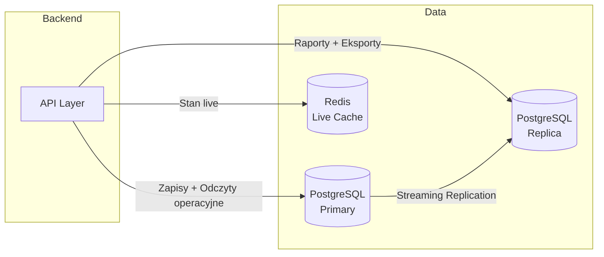
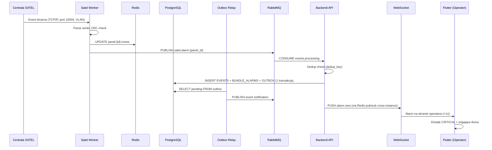

# 02_ARCHITECTURE.md

## 1. Overview

System jest event-driven, wysokodostępny (HA), oparty o lokalną infrastrukturę firmy z możliwością integracji z chmurą w przyszłości.

Architektura została zaprojektowana pod:
- dużą liczbę alarmów w krótkim czasie,
- niskie opóźnienia (reakcja < 1s dzięki TCP/IP),
- odporność na awarie,
- możliwość pracy wielu operatorów równolegle,
- łatwą rozbudowę w przyszłości.

System NIE obsługuje live CCTV ani streamów wideo.
W bazie są wyłącznie dane o rejestratorach (loginy, IP, hasła, lokalizacja).

---

## 2. Warstwy systemu

### 2.1 Client Layer (Frontend)

Technologia:
- Flutter Desktop (Windows)
- Flutter Mobile (Android, opcjonalnie iOS)

Odpowiedzialności:
- UI operatora i admina
- Obsługa alarmów w czasie rzeczywistym
- Wyświetlanie map i danych obiektów
- Cache offline (SQLite)
- PIN + biometria
- Selektywne pobieranie plików (zdjęcia, mapy, plany)

Komunikacja:
- WebSocket / SSE (push alarmów i zmian stanu)
- REST API (dane, konfiguracja, raporty)

---

### 2.2 API Layer (Backend Core)

Technologia:
- Python + FastAPI

Odpowiedzialności:
- Autoryzacja i role
- Logika biznesowa alarmów
- Obsługa statusów alarmów
- Bundling / deduplikacja
- Synchronizacja danych
- API dla klientów
- Audit log

---

### 2.3 Satel Worker Layer (Hardware Driver)

Technologia:
- Python (Asyncio)
- Dedykowany mikroserwis (jeden proces lub pool procesów)

Odpowiedzialności:
- **Stałe połączenie TCP/IP** z modułami ETHM-1 (port 10004).
- Polling stanu wejść/wyjść/awarii (co 1-2s).
- Odbiór zdarzeń w czasie rzeczywistym.
- Wysyłanie komend (Arm/Disarm) z kolejki RabbitMQ.
- Reconnect logic (Exponential Backoff).
- Zrzut stanu centrali do Redis (Live Cache).

---

### 2.4 Event & Messaging Layer

Technologia:
- RabbitMQ

Odpowiedzialności:
- Kolejkowanie alarmów (Events Queue).
- Kolejkowanie komend sterujących (Command Queue).
- Gwarancja dostarczenia zdarzeń.
- Odporność na burst.

Zasada:
- Worker wrzuca zdarzenie → RabbitMQ → Backend → WebSocket → Frontend.

---

### 2.5 Integration Layer (Inne)

#### SMS (temperatura)
- GSM modem jako główne źródło SMS
- Parser SMS (Efento, Bluelog)
- Fallback: SMS API (future)

---

### 2.6 Data Layer

Główna baza:
- **PostgreSQL** (core system of record: historia, konfiguracja, audit).

Live State Cache:
- **Redis** (aktualny stan wejść/wyjść, sesje TCP).
- Cel: Błyskawiczny dostęp do "Co jest uzbrojone?" bez katowania bazy SQL.
- **WebSocket Event Buffer:** Sorted Set `ws:events:buffer` (max 5000 wpisów) — catch-up Tier 1 po reconnect klienta. Przy >5000 utraconych eventów lub po restarcie Redisa, backend automatycznie odpytuje PostgreSQL (Tier 2, tabela `outbox`). Szczegóły: **10_API_HIGH_LEVEL.md, sekcja 8.5**.

Cache lokalny:
- SQLite (frontend offline).

Pliki:
- Storage lokalny na serwerze backendu.

### 2.6.1 Separacja Ruchu Transakcyjnego i Analitycznego

Priorytet: v1.0

W celu uniknięcia przeciążenia głównej bazy danych przez ciężkie zapytania raportowe, system rozdziela ruch na dwa strumienie:

**Primary (read-write):**
- Zapisy: alarmy, komendy, audit log, CRUD obiektów.
- Odczyty operacyjne: lista alarmów dla operatora, szczegóły obiektu, WebSocket feed.
- Redis Cache jest nadal pierwszym źródłem dla stanów live (uzbrojenie, wejścia, awarie).

**Read-Only Replica (analityczna):**
- Wszystkie zapytania raportowe (`GET /api/reports/*`).
- Eksporty danych (CSV, PDF).
- Operacje administracyjne typu SELECT o dużym obciążeniu (np. statystyki, audyt).
- Timeout: 30s per zapytanie (patrz **10_API_HIGH_LEVEL.md, sekcja 10**).

**Mechanizm:**
- PostgreSQL Streaming Replication (asynchroniczna, lag < 1s w normalnych warunkach).
- Backend używa różnych connection stringów w zależności od typu zapytania:
  - `DATABASE_URL` — primary (read-write)
  - `DATABASE_REPLICA_URL` — replica (read-only)
- Konfiguracja replikacji: **11_DEPLOYMENT.md, sekcja 7**.

---

## 3. High Availability (HA)

Cel:
- 99.9% dostępności (SLO: `17_MONITORING.md`, sekcja 6)
- Automatyczny failover bez interwencji człowieka

Architektura HA (szczegóły: `09_HA_RTO_RPO.md`):

| Komponent | Strategia HA | RTO |
|---|---|---|
| PostgreSQL | Patroni (auto-failover) + etcd + PgBouncer | < 30s |
| Backend API | 2 instancje za Nginx (health-check routing) | < 15s |
| Satel Worker | Redis leader election per panel | < 60s |
| RabbitMQ | Durable queues + Quorum Queues (v2.0) | < 5s (restart) |
| Redis | AOF persistence + Sentinel (v2.0) | < 30s |

---

## 4. Failover & Recovery

### Automatyczny Failover
- **PostgreSQL:** Patroni promuje replikę → PgBouncer przekierowuje ruch → brak zmiany connection stringów.
- **Backend crash:** Nginx usuwa instancję z upstream (health-check `/readyz`), ruch kierowany na pozostałą.
- **Satel Worker:** Redis lock TTL wygaśnie → drugi Worker przejmuje panel.
- **Outbox Relay:** Docker restart policy `always` → automatyczny restart po crash.

### Graceful Shutdown
Wszystkie serwisy obsługują `SIGTERM`: dokończenie aktywnych requestów, zamknięcie połączeń WS, flush Redis pipeline. Szczegóły: `09_HA_RTO_RPO.md`, HA-04.

### Offline (Frontend)
- Frontend przechodzi w tryb **read-only** z danymi z SQLite cache.
- **Przyciski mutacji (Claim, Ack, Resolve, Close) są WYŁĄCZONE** w trybie offline.
- Brak sterowania centralą.
- Baner: "⚠️ Tryb offline — dane mogą być nieaktualne".
- **Intent Queue:** Operator może zapisywać lekkie intencje (np. "zamierzam obsłużyć alarm X"). Po reconnect, backend arbitruje intencje z bieżącym stanem. Szczegóły: **03_FUNCTIONAL_MODULES.md, sekcja 19.4**.

---

## 5. Tryby pracy systemu

### Normal Mode
- Pełna obsługa alarmów
- Push w czasie rzeczywistym
- Sterowanie centralą (Arm/Disarm)

### Test Mode
- Alarmy testowe
- Ukryte z głównego feedu

### Service / Maintenance Mode (per obiekt)
- Alarmy oznaczone jako serwisowe
- Ograniczone powiadomienia

### Degraded Mode
- Brak połączenia z backendem.
- Tylko dane lokalne (SQLite).
- Baner: "⚠️ Brak połączenia z serwerem".
- Akcje offline kolejkowane — sync po przywróceniu połączenia.
- Szczegóły: sekcja 4 (Failover & Recovery).

---

## 6. Push & Realtime

Mechanizm:
- WebSocket lub SSE

Zasady:
- Alarmy pushowane do wszystkich zalogowanych operatorów
- Zmiany stanu (Uzbrojono/Rozbrojono) pushowane natychmiast
- Statusy alarmów synchronizowane w czasie rzeczywistym

---

## 7. Scalability Assumptions

Zakładana skala:
- MVP: 5 obiektów (ETHM-1).
- Docelowo: 300–500 obiektów.
- Burst: 200+ alarmów w 15 minut.

Architektura pozwala na:
- Skalowanie Workerów (szarding po ID centrali).
- Redis radzi sobie z milionami operacji/s.

---

## 8. Security Architecture

- VPN dla dostępu do backendu (Nginx wystawia port 443)
- **JWT RS256** z rotacją kluczy (`kid` header) — szczegóły: `08_SECURITY_AND_ROLES.md`
- **Docker Secrets** dla wszystkich wrażliwych danych
- RBAC z granularnymi sub-rolami SYSTEM
- Scope enforcement dla FIELD_WORKER/TECHNICIAN
- Audit log (każda akcja logowana z `service_instance_id`)
- Timed Secret Reveal z MultiFernet szyfrowania
- PIN + biometria na urządzeniach mobilnych
- TLS wszędzie: API, replikacja PostgreSQL, RabbitMQ
- **VLAN izolacja** sieci ETHM-1 (`satel_vlan`)
- **WebSocket:** Ticket-based auth (nie `?token=`)

### 8.1 Resilience Patterns

| Pattern | Komponent | Opis |
|---|---|---|
| **Circuit Breaker** | Backend → Redis | Jeśli Redis nie odpowiada 3x pod rząd → otwórz circuit (fallback na direct DB). Auto-close po 30s. |
| **Circuit Breaker** | Backend → RabbitMQ | Jeśli publish failed 3x → Outbox pattern (Event ląduje w DB, Relay dostarczy później). |
| **Bulkhead** | API Layer | Osobne Thread Pool dla /api/reports/* (nie blokuje alarm pipeline). |
| **Retry + Backoff** | Worker → ETHM-1 | Exponential backoff: 1s → 2s → 4s → 8s → 16s → max 30s. |
| **Timeout** | Wszystkie HTTP calls | 5s default, 30s dla raportów. |

**Biblioteka:** `tenacity` (retry/backoff) + custom `CircuitBreaker` class. Szczegóły retry per komponent: `10_API_HIGH_LEVEL.md`, sekcja 7.3.

---

## 9. Non-Goals (wykluczenia)

System NIE:
- streamuje CCTV
- nagrywa wideo
- analizuje obraz

---

## 10. Architecture Principles

- Event-driven
- Single source of truth = PostgreSQL (historia) + Redis (stan live).
- RabbitMQ jako bufor i izolacja.
- Push zamiast polling (dla UI).
- Read-only offline.

---

## 11. Data Flow — End-to-End Alarm (Diagram)

---

## 12. Performance Requirements (NFR)

| Metryka | Target MVP (5 obiektów) | Target v1.0 (100 obiektów) |
|---|---|---|
| GET /api/alarms (lista) | < 200ms (p95) | < 500ms (p95) |
| POST /api/alarms/{id}/claim | < 100ms (p95) | < 200ms (p95) |
| Event → ekran operatora (end-to-end) | < 1s | < 2s |
| Burst: 200 events w 1 min | Bez utraty | Bez utraty |
| Concurrent operators | 5 | 20 |
| WebSocket delivery | < 500ms | < 1s |
| Redis read (live state) | < 1ms | < 5ms |
| Daily event volume | ~500 events | ~10,000 events |

