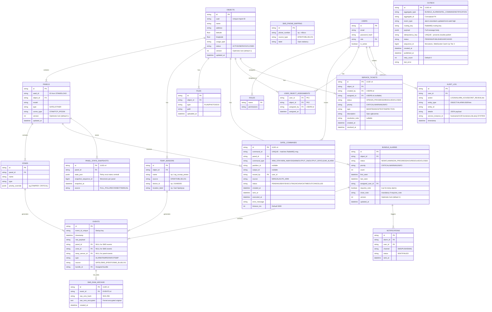

# 04_DATA_MODEL_ERD.md

## Cel
Ten dokument definiuje model danych systemu jako kontrakt. Każda zmiana w strukturze danych musi być odzwierciedlona w tym dokumencie.

---

## ERD (Entity Relationship Diagram)



---

## Opis Encji

### 1. OBJECTS (Obiekty)
Reprezentuje fizyczną lokalizację (sklep, magazyn, biuro).
- **Klucz naturalny:** Adres + typ, system używa wewnętrznego UUID.
- **Pola kluczowe:** `address`, `usage_type`, `latitude/longitude` (geokodowanie).

### 2. PANELS (Centrale)
Fizyczne urządzenie alarmowe (głównie SATEL).
- **Relacja:** Należy do jednego Obiektu.
- **Integracja:** Import z DLOAD (funkcja Monitorowanie, TCP/IP).

### 3. ZONES (Strefy / Wejścia)
Logiczna część systemu alarmowego lub fizyczne wejście czujki.
- **`priority_override`** (JSONB): Opcjonalne nadpisanie priorytetu per typ zdarzenia i strefa. Format: `{"TAMPER": "CRITICAL", "ALARM": "WARNING"}`. Jeśli wpis istnieje, Backend używa go zamiast `default_priority` z Workera. Konfigurowane przez ADMIN/MASTER. Szczegóły: **13_EVENT_SCHEMAS.md, sekcja 2**.

### 4. TEMP_SENSORS (Czujniki Temperatury)
Czujniki Efento / Bluelog przypisane do obiektu.
- **Mapowanie:** Nazwa czujnika z SMS → sensor w bazie → Obiekt.
- **Źródło:** SMS z dwóch zaufanych numerów (Efento Cloud, Bluelog).

### 5. SMS_PHONE_MAPPING (Mapowanie Nadawców SMS)
Tabela mapująca numery telefonów na źródła alarmów.
- **Zasada:** Tylko znane numery (Efento, Bluelog) generują alarmy. Nieznane SMS = ignore + log.

### 6. EVENTS (Zdarzenia Surowe)
Pojedynczy sygnał z systemu. Immutable, duży wolumen.
- **Dedup:** `event_id_unique` filtruje duplikaty.
- **FK `bundle_id`:** Każdy event jest przypisany do jednego Bundle.

### 7. BUNDLE_ALARMS (Alarmy Zgrupowane / Incydenty)
Logiczny incydent widziany przez operatora. Agreguje wiele EVENTS.
- **Statusy:** NEW → CLAIMING → IN_PROGRESS → ACK → RESOLVED → CLOSED.
- **CLAIMING:** Stan przejściowy (max 5s TTL) — operator kliknął claim, backend przetwarza. Zapobiega race condition przy równoczesnym claim.
- **Optimistic Locking:** Pole `version` inkrementowane przy każdej zmianie statusu. Frontend wysyła `version` w request — jeśli nie zgadza się z DB → `409 ALARM_STALE_VERSION`.
- **Temperatura:** `requires_note = true` — zamknięcie wymaga notatki.

### 7a. OUTBOX (Kolejka Wyjściowa — Outbox Pattern)
Bufor gwarantujący atomowość zapisu do DB i publikacji do RabbitMQ.
- **Zasada:** Zamiast `db.insert() + rabbitmq.publish()` (dual-write), backend zapisuje event do tabeli `outbox` w tej samej transakcji co zapis do `EVENTS`/`BUNDLE_ALARMS`. Dedykowany relay (co 100ms) publikuje wiadomości do RabbitMQ i oznacza jako `PUBLISHED`.
- **Idempotency:** Pole `idempotency_key` (UNIQUE) zapobiega podwójnej publikacji. Format: `{aggregate_type}:{aggregate_id}:{event_type}:{version}`.
- **Lifecycle:** `PENDING` → `PUBLISHED` → `ARCHIVED` (cleanup po 7 dniach).
- **`sequence_id`:** Globalny monotoniczny identyfikator (BIGINT, `GENERATED ALWAYS AS IDENTITY`). Używany przez WebSocket Tiered Catch-Up Tier 2 (fallback PostgreSQL). Szczegóły: **10_API_HIGH_LEVEL.md, sekcja 8.5**.
- **Retry:** Max 5 prób, potem log CRITICAL i manual review.

### 7b. SATEL_COMMANDS (Komendy Sterujące — Tracking)
Śledzenie pełnego cyklu życia komend wysyłanych do central Satel (Arm/Disarm/Output).
- **Statusy:** `PENDING` → `SENT` → `EXECUTING` → `ACK` / `NACK` / `TIMEOUT` / `CANCELLED`.
- **Source:** `MANUAL` (operator) lub `AUTO_ARM` (harmonogram).
- **Cel:** Eliminacja rozbieżności Redis↔PostgreSQL — ta tabela jest źródłem prawdy o stanie komendy. Redis wyświetla stany przejściowe (`ARMING_*`/`DISARMING`), ale `satel_commands` jest autorytatywne.

### 8. USERS & ROLES
Model RBAC. Role: SYSTEM (sub-role: SYSTEM_WORKER, SYSTEM_SMS, SYSTEM_RELAY), MASTER, ADMIN, OPERATOR, TECHNICIAN, FIELD_WORKER.

### 8a. USER_OBJECT_ASSIGNMENTS (Przypisania Obiektów do Użytkowników)
Tabela enforce'ująca scope dla ról FIELD_WORKER i TECHNICIAN.
- **PK złożony:** `(user_id, object_id)` — użytkownik może mieć wiele przypisanych obiektów.
- **Zasada:** Brak przypisań = brak dostępu do jakichkolwiek obiektów (fail-closed).
- **Audyt:** Każda zmiana (dodanie/usunięcie) logowana w `AUDIT_LOG`.
- **Referencja:** Specyfikacja enforcement — `08_SECURITY_AND_ROLES.md`, sekcja "Scope Enforcement".

### 9. FILES
Dokumentacja techniczna, plany, zdjęcia. Pliki na dysku, metadata w bazie.

### 10. AUDIT_LOG
Append-only rejestr każdej istotnej akcji w systemie.
- Logowanie, odsłonięcie hasła, zmiana statusu alarmu, edycja obiektu.
- **Pole `service_instance_id`:** Dla akcji wykonywanych przez role SYSTEM_* — identyfikuje konkretny kontener/instancję serwisu (hostname kontenera). Umożliwia debugowanie w środowisku wieloinstancyjnym.

### 11. PANEL_STATE_SNAPSHOTS (Snapshoty Stanu Centrali)
Persystentna kopia stanu centrali zapisywana przez Satel Worker jako fallback dla Redis.
- **Cel:** Jeśli Redis pozbawiony jest danych (restart, TTL, awaria), Worker po reconnect do ETHM-1 nie ma bazy do generowania eventów delta. Snapshot z PostgreSQL stanowi baseline.
- **`state_json`:** Pełny zrzut stanu: strefy (armed/disarmed/alarm), wejścia (ok/violation/tamper), wyjścia, awarie.
- **`source`:** `FULL_POLL` (cykliczny, co 60s), `RECONNECT` (po ponownym połączeniu), `MANUAL` (żądanie diagnostyczne).
- **Retencja:** Ostatnie 100 snapshotów per panel (starsze archiwizowane po 30 dniach).
- **`snapshot_sequence_id`:** Monotoniczny per panel (BIGINT). Używany do porównywania stale snapshotów. Szczegóły: **09_HA_RTO_RPO.md, sekcja HA-06**.
- **Referencja:** `09_HA_RTO_RPO.md`, sekcja HA-06.

### 12. SMS_RAW_ARCHIVE (Archiwum Pełnych SMS)
Izolowany magazyn oryginalnych treści SMS zawierających potencjalne dane osobowe (PII).
- **Cel:** `raw_sms` nigdy nie trafia do RabbitMQ ani `EVENTS.details`. Tylko hash (`raw_sms_hash`) jest przechowywany w głównym flow. Oryginał szyfrowany (Fernet) i dostępny wyłącznie dla ról MASTER/SYSTEM.
- **Dostęp:** Wymagane uprawnienie `sms_raw:read`. Każdy dostęp logowany w `AUDIT_LOG` (action: `SMS_RAW_ACCESS`).
- **Retencja:** 90 dni, potem automatyczne usuwanie.
- **Referencja:** `08_SECURITY_AND_ROLES.md` (PII Isolation), `13_EVENT_SCHEMAS.md` (schema `raw_sms_hash`).

### 13. SERVICE_TICKETS (Zgłoszenia Serwisowe) — RA-04
Manualnie tworzone zgłoszenia usterek, testów lub inspekcji przez TECHNICIAN / FIELD_WORKER / OPERATOR.
- **Statusy:** `OPEN → IN_PROGRESS → RESOLVED → CLOSED`.
- **Typy:** `MAINTENANCE` (usterka), `TEST` (test instalacji), `INSPECTION` (przegląd).
- **Priorytety:** `CRITICAL / WARNING / INFO` — widoczne na dashboardzie operatora.
- **Relacje:** Przypisane do obiektu (`object_id`), tworzone przez użytkownika (`created_by`), opcjonalnie przypisywane do technika (`assigned_to`).
- **Referencja:** `03_FUNCTIONAL_MODULES.md`, moduł 18 (Zgłoszenia Serwisowe) + `15_USER_STORIES_MVP.md`, US-016.

### Strategia Partycjonowania — EVENTS

> **Problem:** Tabela EVENTS jest najszybciej rosnącą tabelą w systemie. Przy 300 obiektach × 10 eventów/dzień/obiekt = ~3000 eventów/dzień = ~1M/rok. Bez partycjonowania wydajność zapytań degraduje się po 6-12 miesiącach.

**Strategia:** Range partitioning po `timestamp`, partizje miesięczne.

```sql
CREATE TABLE events (
    -- kolumny jak w ERD
) PARTITION BY RANGE (timestamp);

-- Tworzenie partycji (automatyzacja: pg_partman lub cron)
CREATE TABLE events_2026_01 PARTITION OF events
    FOR VALUES FROM ('2026-01-01') TO ('2026-02-01');
CREATE TABLE events_2026_02 PARTITION OF events
    FOR VALUES FROM ('2026-02-01') TO ('2026-03-01');
```

**Polityka retencji:**
- Partycje starsze niż **12 miesięcy** → przenoszone do archiwum (osobny tablespace lub backup).
- Partycje starsze niż **36 miesięcy** → drop (po zweryfikowaniu, że backup istnieje).
- **Uwaga:** Raporty historyczne powinny uwzględniać tylko partycje aktywne.

---

## Indeksy Bazy Danych

> **Zasada ogólna:** Wszystkie tabele powinny mieć odpowiednie indeksy wspierające najczęstsze zapytania (filtrowanie po dacie, obiekcie, statusie). Poniżej zdefiniowane są wymagane indeksy dla kluczowych tabel.

### EVENTS

| Indeks | Kolumna(y) | Typ | Uzasadnienie |
|---|---|---|---|
| `idx_events_timestamp` | `timestamp` | B-tree | Filtrowanie i sortowanie zdarzeń po dacie |
| `idx_events_bundle_id` | `bundle_id` | B-tree | Złączenia z BUNDLE_ALARMS, listowanie eventów per bundle |
| `idx_events_dedup` | `event_id_unique` | Unique B-tree | Szybka deduplikacja przy insercie |
| `idx_events_source` | `source` | B-tree | Filtrowanie po źródle (SATEL/SMS_EFENTO/SMS_BLUELOG) |

> **Uwaga:** Tabela EVENTS nie ma bezpośredniego `object_id`. Dostęp do eventów per obiekt realizowany jest przez relację `EVENTS.bundle_id` → `BUNDLE_ALARMS.object_id`. Indeks na `bundle_id` wspiera ten pattern.

### BUNDLE_ALARMS

| Indeks | Kolumna(y) | Typ | Uzasadnienie |
|---|---|---|---|
| `idx_bundle_object_id` | `object_id` | B-tree | Filtrowanie alarmów per obiekt |
| `idx_bundle_status` | `status` | B-tree | Filtrowanie po statusie (NEW, IN_PROGRESS, etc.) |
| `idx_bundle_priority` | `priority` | B-tree | Filtrowanie po priorytecie (CRITICAL/WARNING/INFO) |
| `idx_bundle_first_seen` | `first_seen` | B-tree | Sortowanie i filtrowanie po dacie utworzenia |
| `idx_bundle_last_seen` | `last_seen` | B-tree | Sortowanie po ostatniej aktywności |
| `idx_bundle_status_priority` | `(status, priority)` | Composite B-tree | Optymalizacja głównego widoku operatora (NEW + CRITICAL) |
| `idx_alarms_cursor` | `(first_seen DESC, id DESC)` | Composite B-tree | **Cursor-based pagination** — wymagany przez `GET /api/alarms` (Keyset Pagination). Szczegóły: **10_API_HIGH_LEVEL.md, sekcja 9.1** |

### AUDIT_LOG

| Indeks | Kolumna(y) | Typ | Uzasadnienie |
|---|---|---|---|
| `idx_audit_timestamp` | `timestamp` | B-tree | Filtrowanie logów po dacie |
| `idx_audit_user_id` | `user_id` | B-tree | Filtrowanie logów per użytkownik |
| `idx_audit_action` | `action` | B-tree | Filtrowanie po typie akcji |
| `idx_audit_entity` | `(entity_type, entity_id)` | Composite B-tree | Wyszukiwanie historii zmian per encja |

### OUTBOX

| Indeks | Kolumna(y) | Typ | Uzasadnienie |
|---|---|---|---|
| `idx_outbox_pending` | `created_at` (WHERE status='PENDING') | Partial B-tree | Relay poller — szybkie pobieranie oczekujących wiadomości |
| `idx_outbox_archived` | `published_at` (WHERE status='ARCHIVED') | Partial B-tree | Cleanup job — usuwanie starych wpisów |
| `uq_outbox_idempotency` | `idempotency_key` | Unique B-tree | Zapobieganie podwójnej publikacji |

### SATEL_COMMANDS

| Indeks | Kolumna(y) | Typ | Uzasadnienie |
|---|---|---|---|
| `idx_cmd_panel_status` | `(panel_id, status)` | Composite B-tree | Szybkie sprawdzanie aktywnych komend per centrala |
| `idx_cmd_created` | `created_at DESC` | B-tree | Sortowanie historii komend |
| `uq_cmd_command_id` | `command_id` | Unique B-tree | Korelacja z wiadomościami RabbitMQ |
