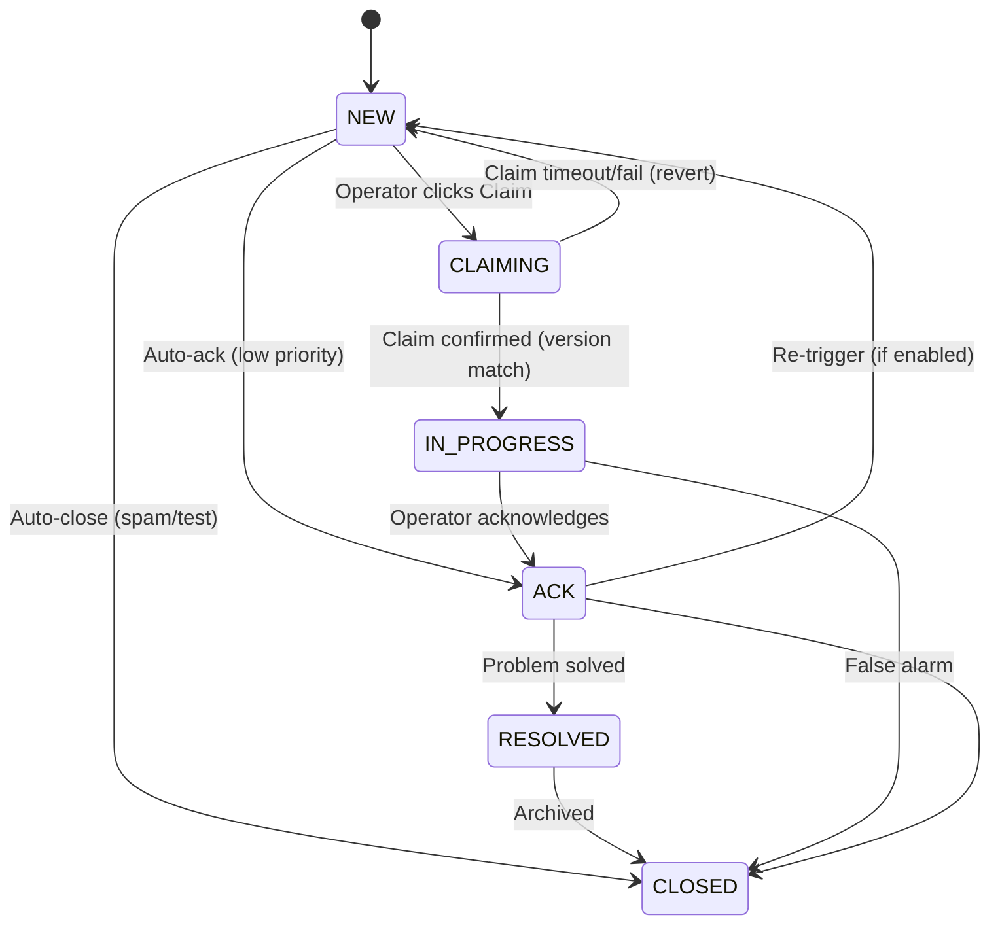

# 05_ALARM_LIFECYCLE.md

## Cel
Ten dokument opisuje cykl życia alarmu, logikę grupowania (bundling) oraz stany, przez które przechodzi incydent.

---

## 1. Definicje

### Raw Event (Zdarzenie Surowe)
Pojedynczy sygnał techniczny odebrany przez system.
- Źródła: Plik STAM, API Satel, SMS (modem).
- Przykłady: "Włamanie strefa 1", "Słaba bateria", "Temperatura wysoka".

### Bundle Alarm (Alarm Zgrupowany / Incydent)
Jednostka operacyjna, którą widzi i obsługuje człowiek. Powstaje z agregacji Raw Events.

---

## 2. Diagram Stanów (Alarm Bundle)



### Opis stanów (KANONICZNE — jedyna wersja):
- **NEW:** Alarm utworzony, nieobsłużony. Wymaga uwagi. Migający na czerwono.
- **CLAIMING:** Stan przejściowy (max 5s). Operator kliknął "Obsługuj", backend weryfikuje `version` i ustawia `assigned_user_id`. Jeśli `version` nie zgadza się (inny operator był szybszy) → revert do NEW. Frontend wyświetla spinner "Przypisywanie...".

> [!NOTE]
> **CLAIMING Reaper Job:** Backend API uruchamia periodyczny task (co 15s) revertujący alarmy zablokowane w stanie CLAIMING >10s:
> ```sql
> UPDATE bundle_alarms 
> SET status = 'NEW', assigned_user_id = NULL, version = version + 1
> WHERE status = 'CLAIMING' AND updated_at < NOW() - INTERVAL '10 seconds';
> ```
> Obie instancje Backend wykonują reaper — bezpieczne dzięki OCC (`version` bump). Każdy revert logowany w `AUDIT_LOG` jako `CLAIMING_TIMEOUT_REVERT`. Metryka Prometheus: `claiming_timeout_reverts_total`.
- **IN_PROGRESS:** Claim potwierdzony. Inni widzą, kto się tym zajmuje.
- **ACK (Acknowledged):** Alarm potwierdzony (np. "Wiem o tym, czekam na serwis"). Nie wyje, ale wisi na liście.
- **RESOLVED:** Problem rozwiązany, oczekuje na zamknięcie / archiwizację.
- **CLOSED:** Zakończony. Trafia do historii.

### Alarmy temperaturowe — specjalna reguła:
- Alarmy z czujników temp. (Efento/Bluelog) mają flagę `requires_note = true`.
- Nie można zamknąć (CLOSED) bez wpisania notatki wyjaśniającej przyczynę / podjęte działania.
- Dotyczy zarówno pojedynczych eventów jak i całego Bundle.

### Tabela przejść (wyczerpująca — każde inne przejście = 409 ALARM_INVALID_STATE):

| Z | Do | Trigger | Warunek |
|---|---|---|---|
| `NEW` | `CLAIMING` | `POST /alarms/{id}/claim` | `version` match |
| `CLAIMING` | `IN_PROGRESS` | Backend potwierdza claim (ta sama transakcja) | `assigned_user_id` ustawiony |
| `CLAIMING` | `NEW` | Timeout 5s lub błąd | Revert `assigned_user_id = NULL` |
| `NEW` | `ACK` | Auto-ack (niskopriorytetowy) | `priority = INFO` |
| `NEW` | `CLOSED` | Auto-close (spam/test) | Obiekt w trybie TEST |
| `IN_PROGRESS` | `ACK` | `POST /alarms/{id}/ack` | `version` match, notatka wymagana |
| `IN_PROGRESS` | `CLOSED` | `POST /alarms/{id}/close` | `version` match, fałszywy alarm |
| `ACK` | `RESOLVED` | `POST /alarms/{id}/resolve` | `version` match |
| `ACK` | `CLOSED` | `POST /alarms/{id}/close` | `version` match |
| `ACK` | `NEW` | Re-trigger (nowy event do bundle) | `BUNDLE_RETRIGGER_ENABLED = true` |
| `RESOLVED` | `CLOSED` | `POST /alarms/{id}/close` | `version` match, notatka jeśli `requires_note` |

> **Optimistic Locking:** Każda zmiana statusu wymaga podania aktualnej wartości `version` z frontendu. Backend wykonuje `UPDATE ... WHERE id = :id AND version = :version AND status = :expected_status`. Jeśli 0 wierszy zmodyfikowanych → `409 ALARM_STALE_VERSION` (ktoś inny zmodyfikował alarm w międzyczasie).

---

## 3. Logika Bundlingu (Grupowania)

Aby uniknąć "burzy alarmów" (alarm flood), system grupuje zdarzenia.

### Zasada grupowania:
1. Przychodzi **Event A** (Obiekt X, Typ: Włamanie).
2. Sprawdzamy, czy istnieje otwarty **Bundle** dla Obiektu X o podobnym priorytecie.
3. **JEŚLI TAK:**
   - Dodaj Event A do istniejącego Bundle.
   - Podbij licznik (`count++`).
   - Zaktualizuj `last_seen`.
   - Jeśli status był ACK, może (konfigurowalne) wrócić do NEW (re-trigger).
4. **JEŚLI NIE:**
   - Utwórz nowy Bundle.
   - Status = NEW.
   - `first_seen` = teraz.

### Okno czasowe:

> [!CAUTION]
> **Alarmy CRITICAL nigdy nie są automatycznie zamykane.** Wymagają pełnej ścieżki operatora: `ACK → RESOLVED → CLOSED`. Auto-close dla CRITICAL = ukrycie nieobsłużonego zagrożenia.

- **CRITICAL:** Auto-close **WYŁĄCZONY**. Parametr: `BUNDLE_AUTO_CLOSE_CRITICAL = false`.
- **WARNING:** Auto-close po **8 godzinach** spokoju (brak nowych eventów). Parametr: `BUNDLE_AUTO_CLOSE_HOURS_WARNING = 8`.
- **INFO:** Auto-close po **4 godzinach** spokoju. Parametr: `BUNDLE_AUTO_CLOSE_HOURS_INFO = 4`.
- W MVP zamykanie CRITICAL jest wyłącznie ręczne.
- **Stale Alarm Report:** Codzienny cron job (`stale_alarm_report`) generuje raport Bundle CRITICAL otwartych >24h. Raport wysyłany do użytkowników z rolą MASTER. Szczegóły: **03_FUNCTIONAL_MODULES.md**.

### Klucz grupowania:
- Bundle grupuje po: `(object_id, priority)`.
- CRITICAL i WARNING to **osobne Bundle** (nigdy nie łączone).
- Alarmy TEMP (SMS) tworzą **osobne Bundle** od alarmów SATEL (nawet dla tego samego obiektu).
- Alarmy UNAUTHORIZED_ACCESS tworzą **osobne Bundle** (priorytet WARNING lub CRITICAL wg konfiguracji obiektu).

### Re-trigger:
- Domyślnie **wyłączony** w MVP.
- Jeśli włączony: event do Bundle w statusie ACK zmienia status z powrotem na NEW.
- Konfigurowalny parametr: `BUNDLE_RETRIGGER_ENABLED` (default: false).

### Algorytm deduplikacji:
- Klucz deduplikacji (`dedup_key`) generowany per źródło:
  - SATEL: `{panel_id}:{event_code}:{zone_id}:{timestamp zaokrąglony do minuty}`
  - SMS_EFENTO: `SMS_EFENTO:{sensor_name}:{event_type}:{timestamp zaokrąglony do minuty}`
  - SMS_BLUELOG: `SMS_BLUELOG:{device_id}:{event_type}:{timestamp zaokrąglony do minuty}`

> [!IMPORTANT]
> **Pole `event_type` w kluczu SMS** zapobiega fałszywej deduplikacji: jeśli w tej samej minucie nadejdzie SMS "Alarm" i SMS "Powrót do normy" z tego samego czujnika, oba zostaną przetworzone (różne `event_type` = różne `dedup_key`).

- Granularność: 1 minuta (ten sam event w tej samej minucie = duplikat).
- Pełna specyfikacja: **13_EVENT_SCHEMAS.md, sekcja 6**.

---

## 4. Priorytety

| Priorytet | Kolor | Przykłady | Zachowanie |
|---|---|---|---|
| **CRITICAL** | Czerwony | Włamanie, Sabotaż, Panika | Wymaga natychmiastowej reakcji, dźwięk ciągły. |
| **WARNING** | Pomarańczowy | Awar. zasilania, Temp. wysoka | Wymaga reakcji, dźwięk pojedynczy. |
| **INFO** | Niebieski/Szary | Załączenie, Wyłączenie, Test | Logowane, nie budzi operatora (chyba że reguła mówi inaczej). |

---

## 5. Eskalacje (v1.0)
- Jeśli alarm statusu NEW wisi > 5 min → Powiadomienie do Mastera.
- Jeśli alarm statusu NEW wisi > 15 min → SMS do kierownika.
- **Jeśli alarm o priorytecie CRITICAL pozostaje w statusie NEW przez 60 minut** → system automatycznie wysyła SMS do użytkownika z rolą MASTER.
  - Parametr konfiguracyjny: `ESCALATION_CRITICAL_HOURS = 1` (domyślnie).
  - SMS wysyłany przez SMS Agent (modem GSM) — jeśli dostępny, lub przez fallback API.
  - Zdarzenie eskalacji jest logowane w `AUDIT_LOG` z akcją `ESCALATION_SMS`.
  - Treść SMS: `"[STAM] CRITICAL ALARM nieobsłużony >1h: {object_name} - {alarm_description}. Bundle ID: {bundle_id}"`

---

## 6. Zdarzenia Specjalne

### 6.1 Nieautoryzowany Dostęp (UNAUTHORIZED_ACCESS)

Centrala SATEL generuje zdarzenia związane z próbami nieautoryzowanego dostępu:

**Typy zdarzeń:**
- 3 błędne hasła na manipulatorze / czytniku.
- Nieautoryzowana próba dostępu (użycie nieznanego kodu).

**Obsługa w systemie:**
1. Satel Worker odbiera zdarzenie poprzez protokół ETHM-1 (kody zdarzeń: patrz **14_SATEL_COMMANDS.md, sekcja 4** i **06_INTEGRATIONS.md, sekcja 1.4**).
2. Zdarzenie klasyfikowane jako typ `UNAUTHORIZED_ACCESS`.
3. System tworzy Bundle Alarm o priorytecie:
   - `WARNING` (domyślnie) lub
   - `CRITICAL` (w zależności od konfiguracji obiektu — np. obiekty wysokiego ryzyka).
4. Bundle Alarm wymaga obowiązkowej notatki przy zamknięciu (`requires_note = true`), ponieważ może wskazywać na próbę włamania.
5. Zdarzenie logowane w `AUDIT_LOG`.

**Dedup key:** `{panel_id}:UNAUTHORIZED_ACCESS:{timestamp_minute}`

---

## 7. Tryby Specjalne

### 7.1 Tryb Testowy (Test Mode)
- Włączany per Obiekt.
- Eventy są zapisywane, ale nie generują głośnych Bundle (lub mają flagę TEST).
- Nie wysyłają powiadomień zewnętrznych.

### 7.2 Tryb Serwisowy
- Podobny do testowego, ale dla techników pracujących na obiekcie.
