# 03_FUNCTIONAL_MODULES

## Functional Modules – Source of Truth

Każdy moduł posiada przypisaną fazę dostępności:
- **Faza 1** – Fundament (CRUD + Auth + Desktop + Mobile read-only)
- **Faza 2** – Alarm Pipeline (Satel Worker + RabbitMQ + Redis + WebSocket)
- **Faza 3** – Multi-Object + Monitoring
- **Faza 4** – SMS Agent (Temperatury)
- **Faza 5** – Arm/Disarm z UI
- **Faza 6** – HA + Raporty + Rozszerzenia
- **nice-to-have** – dodatki bez przypisanej fazy

Agent AI MUSI respektować te fazy przy planowaniu i implementacji. Feature Flags kontrolują dostępność funkcji między fazami (patrz `19_DEV_TOOLING.md`).

---

## 1. Obiekty (Objects)

Dostępność: Faza 1

Opis:
Centralna encja systemu. Wszystko jest przypisane do obiektu.

Funkcje:
- Tworzenie / edycja / archiwizacja obiektów
- Adres, współrzędne GPS
- Dane kontaktowe
- Typ obiektu
- Status obiektu (ACTIVE, SERVICE, CLOSED)
- Przypisane centrale alarmowe
- Przypisane rejestratory CCTV (tylko dane)

---

## 2. Centrale Alarmowe (Panels)

Dostępność: Faza 1

Opis:
Reprezentacja fizycznych central alarmowych.

Funkcje:
- Numer konta / ID centrali
- Producent (SATEL)
- Typ komunikacji (TCP/IP przez ETHM-1)
- Powiązanie z obiektem
- Status komunikacji
- Lista stref

---

## 3. Strefy i Linie (Zones & Lines)

Dostępność: Faza 1

Opis:
Logiczny podział systemu alarmowego.

Funkcje:
- Definicja stref
- Linie / wejścia
- Typ czujki
- Opisy lokalizacji
- Powiązanie z centralą

---

## 4. Alarmy i Zdarzenia (Alarms & Events)

Dostępność: Faza 2

Opis:
Sercem systemu są alarmy i zdarzenia.

Funkcje:
- Przyjmowanie alarmów z Satel Worker (TCP/IP) i parserów SMS
- Klasyfikacja (ALARM, TAMPER, INFO, TEMP)
- Statusy alarmu (KANONICZNE — patrz 05_ALARM_LIFECYCLE.md):
  - NEW
  - IN_PROGRESS
  - ACK
  - RESOLVED
  - CLOSED
- Przypisanie operatora
- Historia zmian statusu
- Timestampy

---

## 5. Bundling Alarmów

Dostępność: Faza 2

Opis:
Grupowanie wielu alarmów w jeden incydent. Kluczowe dla operatora — bez tego przy burście 200+ eventów operator widzi surowe linie zamiast incydentów.

Funkcje:
- Łączenie alarmów z tego samego obiektu
- Reguły czasowe (np. 5 min)
- Wspólny status dla grupy
- Obsługa jako jeden incydent
- Alarmy temperaturowe wymagają obowiązkowej notatki przy zamykaniu

---

## 6. Integracja SATEL (Satel Worker TCP/IP)

Dostępność: Faza 2

Opis:
Bezpośrednia integracja z centralami Satel przez protokół ETHM-1 (TCP/IP, port 10004).
Szczegóły protokołu: **06_INTEGRATIONS.md, sekcja 1**.

Funkcje:
- Stałe połączenie TCP/IP z modułem ETHM-1 Plus
- Polling stanów wejść, stref, wyjść, awarii
- Odbiór zdarzeń w czasie rzeczywistym
- Mapowanie kont na obiekty
- Obsługa heartbeatów i reconnect (Exponential Backoff)
- Zrzut stanu centrali do Redis (Live State Cache)
- Sterowanie centralą Arm/Disarm (v2.0 / Faza 2)

---

## 7. SMS Integration (Temperatura)

Dostępność: Faza 4

Opis:
Odbiór SMS z czujników temperatury (Efento Cloud, Bluelog).
Szczegóły formatów: **06_INTEGRATIONS.md, sekcja 2**.

Funkcje:
- Odczyt SMS z modemu GSM
- Parser treści (Efento i Bluelog — dwa różne formaty)
- Mapowanie numerów na zaufanych nadawców (SMS_PHONE_MAPPING)
- Mapowanie czujników na obiekty (TEMP_SENSORS)
- Generowanie eventów temperatury z flagą `requires_note`

---

## 8. Użytkownicy i Role

Dostępność: Faza 1

Opis:
Zarządzanie dostępem (RBAC).
Szczegóły ról: **08_SECURITY_AND_ROLES.md**.

Role (KANONICZNE):
- SYSTEM (rola techniczna — Workery, parsery)
- MASTER (właściciel — pełen dostęp)
- ADMIN (zarządzanie użytkownikami, konfiguracja)
- OPERATOR (obsługa alarmów, centrum monitorowania)
- TECHNICIAN (serwisant, tryb terenowy)
- FIELD_WORKER (audytor, testy cykliczne, zgłoszenia serwisowe)

Funkcje:
- Uprawnienia per moduł
- Aktywność użytkowników
- Timed Secret Reveal (odsłanianie haseł z logowaniem)

---

## 9. Powiadomienia

Dostępność: Faza 2

Opis:
System notyfikacji wewnętrznych.

Funkcje:
- Powiadomienia w aplikacji
- Eskalacje
- Przypomnienia o niezamkniętych alarmach

---

## 10. Raporty

Dostępność: Faza 6

Opis:
Raportowanie operacyjne i SLA.

Funkcje:
- Raporty alarmów
- Czas reakcji
- Czas zamknięcia
- Raporty per obiekt
- Eksport PDF / CSV
- **Stale Alarm Report:** Codzienny cron job generujący listę Bundle CRITICAL otwartych >24h. Wysyłany automatycznie do użytkowników z rolą MASTER. Parametr: `STALE_ALARM_REPORT_CRON = "0 8 * * *"` (domyślnie: codziennie o 8:00 UTC).

---

## 11. Dokumentacja Obiektu

Dostępność: Faza 6

Opis:
Pliki i instrukcje dla operatorów.

Funkcje:
- Plany obiektu
- Zdjęcia
- Instrukcje postępowania
- Checklisty

---

## 12. Integracje Zewnętrzne (Future)

Dostępność: nice-to-have

Opis:
Integracje poza SATEL i SMS.

Przykłady:
- API firm ochrony
- Integracja z BMS
- Integracja z systemami ticketowymi

---

## 13. Audyt i Logi

Dostępność: Faza 1

Opis:
Pełna ścieżka audytu (encja AUDIT_LOG).

Funkcje:
- Logi akcji użytkowników
- Logi systemowe
- Historia zmian konfiguracji
- Eksport logów

---

## 14. Backup & Archiwizacja

Dostępność: Faza 6

Opis:
Zabezpieczenie danych.

Funkcje:
- Backup bazy danych
- Backup plików
- Retencja danych
- Archiwizacja alarmów

---

## 15. Aplikacja Mobilna — Widok Operatora Terenowego

Dostępność: Faza 1

Opis:
Uproszczony widok mobilny dla operatora pracującego w terenie. Zaprojektowany pod szybki dostęp do najważniejszych informacji bez konieczności przeglądania pełnego dashboardu.

Funkcje:
- **Lista aktywnych alarmów** — tylko kluczowe informacje: obiekt, priorytet, czas, status. Bez szczegółów technicznych (raw events).
- **Szybkie akcje Arm/Disarm** — dla obiektów oznaczonych jako ulubione. Jedno kliknięcie > komenda do Satel Worker.
- **Widok Ulubione** — lista obiektów oznaczonych gwiazdką przez operatora. Szybki dostęp z głównego ekranu.
- **Widok Ostatnio używane** — lista ostatnio odwiedzanych obiektów (max 10-20 pozycji).
- Offline: podgląd ostatniego znanego stanu obiektów (cache SQLite).

Uwagi:
- Dane ulubionych i ostatnio używanych przechowywane w Redis (backend) + SQLite (frontend offline).
- Patrz również: moduł 17 (Ulubione i Ostatnio używane — wspólny dla desktop i mobile).

---

## 16. Harmonogram Uzbrajania / Rozbrajania (Auto-Arm)

Dostępność: Faza 6

Opis:
Automatyczne uzbrajanie/rozbrajanie obiektów wg zdefiniowanego harmonogramu.
Przykład: przychodnie uzbrajane automatycznie o 24:00, rozbrajane o 6:00.

Funkcje:
- **Konfiguracja per obiekt:**
  - Dzień tygodnia (lub codziennie)
  - Godzina
  - Typ uzbrojenia: `FULL` / `STAY` / `AWAY`
  - Strefa (partition) — opcjonalnie, domyślnie wszystkie
- **Wykonawca:** Dedykowany cron job w backendzie > komenda Arm/Disarm do Satel Worker przez tabelę `satel_commands` + `outbox` + RabbitMQ.
- **Logowanie:** Każde automatyczne uzbrojenie/rozbrojenie zapisywane w `AUDIT_LOG` z adnotacją `source: "AUTO_ARM"`.
- **Obsługa błędów:**
  - Brak łączności z centralą > system generuje alarm `WARNING` (Auto-arm failed: brak komunikacji z centralą).
  - Komenda `NACK` > retry 2x z 30s delay, potem > alarm `WARNING` + log.
- **UI:** Panel konfiguracji harmonogramów w ustawieniach obiektu (dostępny dla ADMIN/MASTER).

### Conflict Resolution (Manual > Automatic)

**Reguła nadrzędna:** Manualna komenda operatora ZAWSZE ma priorytet nad automatycznym harmonogramem.

**Mechanizm cooldown:** Jeśli operator ręcznie rozbroił obiekt, Auto-Arm pomija ten obiekt przez czas cooldown. Zapobiega sytuacji: technik rozbreja centralę o 23:59, cron uzbraja z powrotem o 24:00.

**Łańcuch decyzyjny (6 kroków):**

```mermaid
flowchart TD
    A["Cron: Auto-Arm trigger dla Obiektu X"] --> B{"Obiekt w trybie SERVICE/CLOSED?"}
    B -- TAK --> C["SKIP — log: obiekt w trybie serwisowym"]
    B -- NIE --> D{"Aktywny manualny DISARM w oknie cooldown?"}
    D -- TAK --> E["SKIP — log: manual override active"]
    D -- NIE --> D2{"Aktywne okno serwisowe DLOAD?"}
    D2 -- TAK --> E2["SKIP — log: DLOAD_SERVICE_WINDOW"]
    D2 -- NIE --> F{"Istnieje PENDING/SENT komenda dla tej centrali?"}
    F -- TAK --> G["SKIP — log: komenda już w trakcie"]
    F -- NIE --> H{"Status połączenia z centralą?"}
    H -- DISCONNECTED/UNKNOWN --> I["Generuj alarm WARNING: Auto-arm failed"]
    H -- CONNECTED --> J["Wyślij komendę ARM przez satel_commands + outbox"]
    J --> K{"ACK w ramach timeout?"}
    K -- ACK --> L["Sukces — AUDIT_LOG source: AUTO_ARM"]
    K -- NACK/TIMEOUT --> M{"Wyczerpano próby?"}
    M -- NIE --> J
    M -- TAK --> I
```



> [!NOTE]
> **Krok 3 (DLOAD Service Window Check):** Sprawdza czy istnieje aktywne okno serwisowe Connection Release. Jeśli Worker jest rozłączony z centralą z powodu sesji DLOAD, Auto-Arm NIE inkrementuje licznika błędów i NIE generuje alarmu WARNING. SQL: `SELECT 1 FROM audit_log WHERE action = 'PANEL_CONNECTION_RELEASED' AND panel_id = :panel_id AND reconnect_at > NOW()`.

**Sprawdzenie cooldown (SQL):**
```sql
SELECT EXISTS (
  SELECT 1 FROM satel_commands
  WHERE panel_id = :panel_id
    AND command_type = 'DISARM'
    AND source = 'MANUAL'
    AND status = 'ACK'
    AND created_at > now() - interval ':cooldown minutes'
) AS manual_override_active;
```

### Parametry konfiguracyjne (Auto-Arm)

| Parametr | Domyślna | Lokalizacja | Opis |
|---|---|---|---|
| `AUTO_ARM_COOLDOWN_MINUTES` | 60 | Backend .env | Czas cooldown po manualnym disarm |
| `AUTO_ARM_RETRY_COUNT` | 2 | Backend .env | Ilość retry’ów na NACK (total = retry + 1) |
| `AUTO_ARM_RETRY_DELAY_SECONDS` | 30 | Backend .env | Opóźnienie między retryami |

Powiązania:
- Sterowanie centralą: **06_INTEGRATIONS.md, sekcja 1.3**
- Komendy: **14_SATEL_COMMANDS.md, sekcja 2**
- Command tracking: **04_DATA_MODEL_ERD.md, sekcja 7b** (tabela `satel_commands`)
- Audit: **08_SECURITY_AND_ROLES.md, sekcja 3**

---

## 17. Ulubione i Ostatnio Używane (UI)

Dostępność: Faza 6

Opis:
Funkcjonalność wspólna dla interfejsu desktop i mobile, poprawiająca UX przy częstym przełączaniu się między obiektami.

Funkcje:
- **Ulubione (gwiazdka):**
  - Operator oznacza obiekt jako ulubiony (ikona gwiazdki).
  - Lista ulubionych dostępna z głównego widoku / sidebar.
  - Dane przechowywane per użytkownik w backendzie.
- **Ostatnio używane:**
  - System automatycznie śledzi ostatnio odwiedzane obiekty (max 20 pozycji).
  - Lista dostępna z głównego widoku / quick-access panel.
  - Dane przechowywane w Redis (backend, key: `user:{id}:recent_objects`, TTL: 30 dni).
  - Alternatywnie: cache lokalny (SQLite) na frontendzie.
- **Desktop:** Widget w sidebar lub top-bar.
- **Mobile:** Dedykowany tab lub sekcja na ekranie głównym.

---

## 18. Zgłoszenia Serwisowe (Service Tickets)

Dostępność: Faza 6

Opis:
System zgłoszeń serwisowych umożliwiający operatorom tworzenie ticketów z poziomu alarmu lub ręcznie.
Usprawnienie przepływu pracy: operator > ticket > technik.

Funkcje:
- **Tworzenie zgłoszenia:**
  - Z poziomu alarmu (przycisk Utwórz zgłoszenie serwisowe) — automatyczne powiązanie z alarmem.
  - Ręcznie z poziomu obiektu.
- **Dane zgłoszenia:**
  - Obiekt (wymagane)
  - Typ usterki (z predefiniowanej listy + opis tekstowy)
  - Opis problemu
  - Priorytet: `LOW` / `MEDIUM` / `HIGH` / `CRITICAL`
  - Data zgłoszenia (automatyczna)
  - Powiązany alarm (`bundle_id`, opcjonalne)
- **Statusy:** `OPEN` > `IN_PROGRESS` > `CLOSED`
- **Powiadamianie technika:**
  - Email na zdefiniowaną skrzynkę (np. serwis@firma.pl) — konfiguracja globalna lub per obiekt.
  - Opcjonalnie: integracja z zewnętrznym systemem ticketowym (Jira, OSTicket) — v2.0.
- **Śledzenie:** Lista zgłoszeń z filtrami (status, obiekt, priorytet, data).
- **Uprawnienia:** Rola `TECHNICIAN` ma dostęp do przeglądania i aktualizacji statusu zgłoszeń (patrz **08_SECURITY_AND_ROLES.md**).

Powiązania:
- Role: **08_SECURITY_AND_ROLES.md** — uprawnienia `ticket:read`, `ticket:write`
- Alarmy: **05_ALARM_LIFECYCLE.md** — powiązanie ticket > bundle

---

## 19. UI Resilience & Degraded Mode (Flutter)

Dostępność: Faza 1

Opis:
Specyfikacja zachowań UI podczas awarii, degradacji i niestabilności połączenia. Operator MUSI zawsze wiedzieć, w jakim stanie jest system.

### 19.1 Tryb Degraded Mode (UI-01)

| Stan systemu | UI zachowanie | Baner |
|---|---|---|
| **Online (normal)** | Pełna funkcjonalność | Brak banneru |
| **WS disconnected, REST OK** | Dane odświeżane przez polling (co 10s), brak push alarmów | 🟡 "Utracono połączenie real-time. Alarmy odświeżane co 10s." |
| **REST timeout/error** | Ostatnie dane z cache SQLite, formularz read-only | 🔴 "Brak połączenia z serwerem. Dane mogą być nieaktualne." |
| **Pełny offline** | Tylko cache SQLite, brak nowych danych | 🔴 "Tryb offline. Akcje zostaną zsynchronizowane po przywróceniu połączenia." |

**Zasada:** Baner widoczny na KAŻDYM ekranie (top bar), nie tylko na dashboard.

### 19.2 Skeleton / Loading States (UI-02)

Każdy widok MUSI mieć stan skeleton (szkielet ładowania) zamiast pustego ekranu lub spinnera:

| Ekran | Skeleton |
|---|---|
| Lista alarmów | 5 prostokątów (shimmer animation) w kształcie alarm card |
| Szczegóły obiektu | Header placeholder + 3 sekcje shimmer |
| Mapa | Szary placeholder z napisem "Ładowanie mapy..." |
| Raport | Shimmer table (nagłówki + 10 wierszy) |

**Zasady:**
- Skeleton wyświetlany max 5s — po tym czas wyświetl komunikat "Serwer nie odpowiada" z przyciskiem "Ponów próbę".
- Po załadowaniu danych, płynne przejście (fade) z skeleton do treści (200ms).

### 19.3 Obsługa Konfliktu 409 (UI-03)

> **Scenariusz:** Operator edytuje alarm, a inny operator zmienił go w międzyczasie. Serwer zwraca `409 ALARM_STALE_VERSION`.

**Wymagane zachowanie:**
1. **NIE czyść formularza** — dane operatora pozostają w polach.
2. Pokaż dialog: "Alarm został zmodyfikowany przez {modified_by}. Odświeżyć dane?"
3. Dwie opcje:
   - **"Odśwież"** → pobierz nowe dane z serwera, zachowaj zmiany operatora w draft.
   - **"Nadpisz"** → wyślij ponownie z nowym `version` (force update).
4. Toast: "Dane odświeżone. Sprawdź zmiany i zapisz ponownie."

**Implementacja:** Flutter `BLoC` trzyma `draftState` (zmiany operatora) i `serverState` (dane z serwera). Refresh aktualizuje `serverState`, `draftState` pozostaje.

### 19.4 Offline Intent Queue (UI-04)

> [!CAUTION]
> **Tryb offline = READ-ONLY.** Przyciski mutacji (Claim, Ack, Resolve, Close) są **wyłączone** w trybie offline. Zapobiega to masywnym konfliktom wersji (409) przy synchronizacji.

> **Scenariusz:** Operator jest w terenie (telefon offline), widzi alarmy z cache SQLite.

**Mechanizm Intent Queue:**
1. Operator może zapisać **lekkie intencje** ("zamierzam obsłużyć ten alarm") — NIE pełne mutacje stanu.
2. Intencja zapisywana w SQLite: `offline_intents(id, intent_type, bundle_id, created_at, status)`.
3. UI wyświetla: "Intencja zakolejkowana — zostanie przesłana po przywróceniu połączenia. ⏳"
4. Po odzyskaniu połączenia (WS reconnect):
   - System wysyła batch intencji: `POST /api/sync/intents`
   - Backend dla każdej intencji: pobierz aktualny stan → jeśli alarm nadal dostępny (np. status NEW) → wykonaj akcję z bieżącą `version`.
   - Jeśli alarm już zajęty przez innego operatora → `INTENT_REJECTED` z informacją o bieżącym operatorze.
   - Intencje starsze niż 30 min → oznaczone jako `EXPIRED` (nie wysyłane).
5. Po sync: dialog podsumowania: "✅ 2/3 intencji zaakceptowane, ❌ 1 odrzucona (alarm obsługiwany przez Anna Nowak)".
6. Badge na ikonie: "2 oczekujące intencje".

**Obsługiwane intencje offline:**
- INTENT_CLAIM — zamiar obsłużenia alarmu
- INTENT_NOTE — dodanie notatki
- INTENT_SERVICE_TICKET — tworzenie zgłoszenia serwisowego

**NIE obsługiwane offline** (wymagają natychmiastowej odpowiedzi):
- Arm/Disarm (wymaga komunikacji z centralą)
- Secret Reveal
- Zmiana statusu alarmu (Ack, Resolve, Close) — zbyt wysokie ryzyko konfliktu

### 19.5 Data Staleness Indicator (UI-05)

> **Cel:** Operator MUSI wiedzieć, czy patrzy na aktualne dane.

| Kontekst | Trigger | Wskaźnik |
|---|---|---|
| **Lista alarmów** | `last_refresh > 30s` bez WS heartbeat | Zegar: "Dane sprzed {Xs}" + przycisk 🔄 |
| **Stan centrali** | `panel_redis_ttl < 60s` lub `status = UNKNOWN` | ⚠️ "Stan panelu nieznany — brak danych od {X}s" |
| **Raporty** | `X-Data-Freshness: stale` header od API | 🟡 Baner: "Dane mogą być opóźnione o {lag}s (replika)" |
| **Obiekt** | `version` z cache ≠ `version` z serwera | 🔄 "Dostępna nowsza wersja danych" + auto-refresh |

### 19.6 WebSocket Reconnect Strategy (UI-06)

**Algorytm:** Exponential backoff BEZ limitu prób.

```
Initial delay: 3s
Multiply: x2
Max delay cap: 30s

Sequence: 3s → 6s → 12s → 24s → 30s → 30s → 30s → ...
```

**Na każdym reconnect:**
1. Pobierz nowy ticket: `POST /api/auth/ws-ticket`
2. Jeśli ticket failed (401) → redirect na ekran logowania.
3. Jeśli ticket OK → connect `wss://host/api/ws?ticket={ticket}`
4. Po connect → wyślij `replay_request` z ostatnim `sequence_id`
5. Jeśli serwer zwraca `replay_overflow` → przeładuj dane z REST API.

**UI podczas reconnect:**
- Pasek: "Łączenie z serwerem... (próba {N})"
- Po 60s bez połączenia: "Nie udaje się połączyć. Sprawdź połączenie sieciowe."
- Po reconnect: "✅ Połączono. Synchronizacja danych..." → auto-refresh aktywnego widoku.

---

## Zasady dla Agenta AI

- Nie implementuj modułów z późniejszych faz przed zakończeniem bieżącej fazy
- Feature Flags (`19_DEV_TOOLING.md`) kontrolują dostępność funkcji między fazami
- Nie mieszaj odpowiedzialności modułów
- Każdy moduł to osobny kontekst logiczny
- Obiekt = główny agregat domenowy


---
---


# 15_USER_STORIES_MVP

## Cel
User Stories dla modułów MVP z kryteriami akceptacji. Definicja "done" dla każdej funkcjonalności.

---

## Epic 1: Logowanie i Autoryzacja

### US-001: Logowanie operatora
**Jako** OPERATOR, **chcę** zalogować się emailem i hasłem, **aby** rozpocząć dyżur monitorowania.

**Kryteria akceptacji:**
- AC1: Ekran logowania z polami email + hasło
- AC2: Po poprawnym logowaniu → redirect do dashboardu alarmów
- AC3: Po błędnym logowaniu → komunikat "Nieprawidłowy email lub hasło" (nie ujawniaj co jest błędne)
- AC4: Po 5 nieudanych próbach w 1 min → blokada IP na 1 min
- AC5: Po 10 nieudanych próbach → konto zablokowane na 30 min + log w AUDIT_LOG
- AC6: Token JWT przechowywany w pamięci (nie localStorage)

### US-002: Automatyczne odświeżanie sesji
**Jako** OPERATOR, **chcę** żeby sesja działała bez konieczności ponownego logowania, **aby** nie tracić czasu na dyżurze.

**Kryteria akceptacji:**
- AC1: Access Token odświeża się automatycznie przed wygaśnięciem
- AC2: Sesja trwa max 7 dni (refresh token)
- AC3: Po 7 dniach → wylogowanie z komunikatem

---

## Epic 2: Dashboard Alarmów

### US-003: Widok listy alarmów
**Jako** OPERATOR, **chcę** widzieć listę aktywnych alarmów, **aby** szybko zidentyfikować incydenty do obsługi.

**Kryteria akceptacji:**
- AC1: Lista Bundle Alarms (nie surowych eventów)
- AC2: Sortowanie domyślne: first_seen DESC (najnowsze na górze)
- AC3: Kolory: CRITICAL → czerwony, WARNING → pomarańczowy, INFO → szary
- AC4: Alarmy NEW → migająca ikona / animacja
- AC5: Wyświetlane pola: nazwa obiektu, typ alarmu, priorytet, status, czas, liczba eventów, przypisany operator
- AC6: Filtrowanie po: status, priorytet, obiekt
- AC7: Aktualizacja w real-time (WebSocket) — nowy alarm pojawia się natychmiast bez odświeżania

### US-004: Obsługa alarmu (Claim)
**Jako** OPERATOR, **chcę** kliknąć "Obsługuj", **aby** pozostali operatorzy widzieli, że alarm jest w trakcie obsługi.

**Kryteria akceptacji:**
- AC1: Przycisk "Obsługuj" widoczny przy alarmach w statusie NEW
- AC2: Po kliknięciu → status zmienia się na IN_PROGRESS
- AC3: Wyświetla się imię operatora przy alarmie
- AC4: Jeśli inny operator kliknął pierwszy → komunikat "Alarm już obsługiwany przez [imię]"
- AC5: Zmiana statusu widoczna natychmiast u wszystkich operatorów (WebSocket)

### US-005: Potwierdzenie alarmu (ACK)
**Jako** OPERATOR, **chcę** potwierdzić alarm z notatką, **aby** udokumentować swoją reakcję.

**Kryteria akceptacji:**
- AC1: Przycisk "Potwierdź" widoczny przy alarmach IN_PROGRESS
- AC2: Wymagane pole „Notatka" (min. **10 znaków** — spójne z kodem błędu `NOTE_TOO_SHORT` w API)
- AC3: Po potwierdzeniu → status ACK
- AC4: Notatka zapisana w AUDIT_LOG

### US-006: Rozwiązanie alarmu (Resolve)
**Jako** OPERATOR, **chcę** oznaczyć alarm jako rozwiązany, **aby** oddzielić "potwierdzony" od "problem naprawiony".

**Kryteria akceptacji:**
- AC1: Przycisk "Rozwiązany" widoczny przy alarmach ACK
- AC2: Opcjonalna notatka
- AC3: Status → RESOLVED

### US-007: Zamknięcie alarmu (Close)
**Jako** OPERATOR, **chcę** zamknąć alarm, **aby** trafił do historii.

**Kryteria akceptacji:**
- AC1: Przycisk "Zamknij" widoczny przy alarmach RESOLVED
- AC2: Dla alarmów temperaturowych (`requires_note = true`) → notatka OBOWIĄZKOWA (min. 10 znaków)
- AC3: Brak notatki → walidacja: "Alarm temperaturowy wymaga notatki wyjaśniającej"
- AC4: Po zamknięciu → alarm znika z listy aktywnych, trafia do historii
- AC5: Zamknięty alarm nie może być ponownie otwarty

### US-008: Dźwięk alarmu
**Jako** OPERATOR, **chcę** słyszeć dźwięk przy nowym alarmie CRITICAL, **aby** zareagować nawet gdy nie patrzę na ekran.

**Kryteria akceptacji:**
- AC1: CRITICAL → dźwięk ciągły do momentu claim
- AC2: WARNING → dźwięk pojedynczy
- AC3: INFO → brak dźwięku
- AC4: Przycisk "Wycisz" na 5 min

---

## Epic 3: Obiekty

### US-009: Lista obiektów
**Jako** OPERATOR, **chcę** przeglądać listę obiektów, **aby** szybko znaleźć potrzebny adres lub telefon.

**Kryteria akceptacji:**
- AC1: Lista z wyszukiwaniem (po nazwie, adresie)
- AC2: Filtrowanie po statusie (ACTIVE, SERVICE, CLOSED)
- AC3: Wyświetlane: nazwa, adres, status, liczba aktywnych alarmów

### US-010: Szczegóły obiektu
**Jako** OPERATOR, **chcę** zobaczyć szczegóły obiektu, **aby** mieć pełen kontekst przy obsłudze alarmu.

**Kryteria akceptacji:**
- AC1: Adres, kontakt, GPS (mapa)
- AC2: Lista central przypisanych do obiektu
- AC3: Ostatnie alarmy
- AC4: Dane CCTV (tylko login, IP — hasło ukryte do Timed Reveal)

### US-011: Dodanie obiektu
**Jako** ADMIN, **chcę** dodać nowy obiekt do systemu, **aby** monitorować kolejną lokalizację.

**Kryteria akceptacji:**
- AC1: Formularz: nazwa, adres, typ, kontakty
- AC2: Geokodowanie adresu → automatyczne wypełnienie lat/lon
- AC3: Możliwość ręcznej korekty pinezki na mapie
- AC4: Walidacja: unikalna nazwa obiektu

---

## Epic 4: Integracja Satel

### US-012: Widok stanu centrali (stan live z Redis)
**Jako** OPERATOR, **chcę** widzieć aktualny stan central w real-time, **aby** wiedzieć co jest uzbrojone/rozbrojone.

**Kryteria akceptacji:**
- AC1: Widok per panel: lista stref (stan: Armed/Disarmed/Alarm)
- AC2: Lista wejść (stan: OK/Violation/Tamper)
- AC3: Status połączenia Worker (Connected/Reconnecting/Disconnected)
- AC4: Timestamp ostatniego odczytu
- AC5: Dane odświeżane automatycznie (z Redis, co 2s)

### US-013: Notyfikacja o utracie łączności
**Jako** OPERATOR, **chcę** być poinformowany gdy Worker straci połączenie z centralą, **aby** podjąć działania.

**Kryteria akceptacji:**
- AC1: Jeśli Worker "DISCONNECTED" > 2 min → banner ostrzegawczy
- AC2: Jeśli > 5 min → alarm systemowy (CRITICAL)

---

## Epic 5: Integracja SMS

### US-014: Alarm temperatury z SMS
**Jako** SYSTEM, **chcę** automatycznie tworzyć alarm po odebraniu SMS z Efento/Bluelog, **aby** operator został powiadomiony.

**Kryteria akceptacji:**
- AC1: SMS z zaufanego numeru → parsowanie → Raw Event → Bundle Alarm
- AC2: Alarm temperaturowy ma `requires_note = true`
- AC3: SMS z nieznanego numeru → ignoruj + log
- AC4: SMS "Powrót do normy" / "Koniec alertu" → zmiana statusu na INFO (zamknięcie alarmu temp.)

---

## Epic 6: Timed Secret Reveal

### US-015: Odsłonięcie hasła
**Jako** OPERATOR / TECHNIK / AUDYTOR, **chcę** odsłonić hasło do rejestratora CCTV, **aby** sprawdzić obraz z kamery lub wejść do strefy.

**Kryteria akceptacji:**
- AC1: Przycisk "Pokaż hasło" przy danych CCTV
- AC2: Wymagany powód (pole tekstowe, min. 5 znaków)
- AC3: Hasło widoczne przez 60s z countdownem
- AC4: Po 60s → hasło ukryte automatycznie
- AC5: Zdarzenie w AUDIT_LOG: kto, co, kiedy, powód
- AC6: Limity: Operator 10/h, Technik 20/h, Audytor 20/h

### US-016: Zgłoszenie Serwisowe (Manual Alarm)
**Jako** AUDYTOR / TECHNIK, **chcę** manualnie zgłosić usterkę lub wynik testu, **aby** system zarejestrował incydent wymagający obsługi.

**Kryteria akceptacji:**
- AC1: Przycisk "Zgłoś problem" na widoku obiektu
- AC2: Formularz: Priorytet, Opis, Typ (Maintenance/Test)
- AC3: Utworzenie nowego Bundle Alarm w statusie NEW
- AC4: Operatorzy widzą zgłoszenie na Dashboardzie

---

### US-017: Import Obiektów z Excel (Faza 1)
**Jako** ADMIN, **chcę** zaimportować listę obiektów z pliku Excel, **aby** szybko załadować dane bez ręcznego wpisywania.

**Kryteria akceptacji:**
- AC1: Upload pliku `.xlsx` przez `POST /api/admin/import/objects`
- AC2: Walidacja wymaganych kolumn (`nazwa`, `adres`, `typ`)
- AC3: Raport importu: ile zaimportowano, ile pominięto, listę błędów per wiersz
- AC4: Log importu w tabeli `IMPORT_LOG`
- AC5: Duplikaty (po nazwie) raportowane, nie blokują całego importu

---

### US-018: Tryb Serwisowy (Faza 1 config / Faza 2 efekt)
**Jako** TECHNIK, **chcę** włączyć tryb serwisowy na obiekcie, **aby** system wiedział, że prowadzę prace i tłumił alarmy.

**Kryteria akceptacji:**
- AC1: Aktywacja przez `POST /api/objects/{id}/service-mode` z powodem i opcjonalnym `until`
- AC2: Ikona 🔧 widoczna przy obiekcie na liście i w szczegółach
- AC3: (Faza 2) Alarmy z obiektu w trybie serwisowym: obniżony priorytet, brak dźwięku
- AC4: Auto-dezaktywacja po upływie `until`
- AC5: Wpis w `AUDIT_LOG` przy aktywacji i dezaktywacji

---

### US-019: Dziennik Dyspozytora (Faza 2)
**Jako** OPERATOR, **chcę** rejestrować kontakty telefoniczne i notatki podczas obsługi alarmu, **aby** mieć pełną historię działań.

**Kryteria akceptacji:**
- AC1: Formularz wpisu: typ (połączenie wychodzące/przychodzące/notatka/patrol), kontakt, treść
- AC2: Wybór kontaktu z listy `OBJECT_CONTACTS` lub wpis manualny (ale nie oba — walidacja)
- AC3: Lista wpisów per Bundle per Obiekt z paginacją
- AC4: Wpisy widoczne w szczegółach alarmu

---

### US-020: Rejestracja Urządzenia FCM (Faza 2)
**Jako** TECHNIK z aplikacją mobilną, **chcę** otrzymywać push notifications o alarmach CRITICAL, **aby** reagować nawet gdy app jest w tle.

**Kryteria akceptacji:**
- AC1: Rejestracja tokenu FCM przy logowaniu (`POST /api/devices/register`)
- AC2: Wyrejestrowanie przy wylogowaniu (`DELETE /api/devices/{id}`)
- AC3: Push wysyłany tylko dla alarmów CRITICAL (nie dla INFO/WARNING)
- AC4: Push NOT wysyłany dla obiektów w trybie serwisowym

---

## Definition of Done (globalna)

Feature jest "done" gdy:
1. ✅ Wszystkie AC spełnione
2. ✅ Unit testy napisane i zielone (backend)
3. ✅ Brak ostrzeżeń lint (frontend + backend)
4. ✅ Zmiana ma review od co najmniej 1 osoby
5. ✅ Działa na środowisku STAGE
6. ✅ Dokumentacja zaktualizowana (jeśli dotyczy)
7. ✅ `CHANGELOG.md` zaktualizowany
