# 04_DATA_MODEL_ERD.md

## Cel
Ten dokument definiuje model danych systemu jako kontrakt. Każda zmiana w strukturze danych musi być odzwierciedlona w tym dokumencie.

---

## ERD (Entity Relationship Diagram)

```mermaid
erDiagram
    OBJECTS {
        string id PK
        string uuid "Unique import ID"
        string name
        string address
        float latitude
        float longitude
        string usage_type
        string status "ACTIVE/CLOSED"
        boolean service_mode_active "Faza 1: config"
        datetime service_mode_until "nullable - auto-deaktywacja"
        string service_mode_reason "Powód aktywacji"
        string service_mode_activated_by FK "USERS.id"
        int version "Optimistic lock (default 1)"
        datetime updated_at
    }
    PANELS {
        string id PK
        string satel_id "ID from STAM/DLOAD"
        string object_id FK
        string model
        string type "SATEL/OTHER"
        string comm_type "STAM/TCP_IP/GSM"
        int version "Optimistic lock (default 1)"
        datetime updated_at
    }
    ZONES {
        string id PK
        string panel_id FK
        string name
        string type
        jsonb priority_override "eg {TAMPER: CRITICAL}"
    }
    TEMP_SENSORS {
        string id PK
        string object_id FK
        string name "np. Leg_szczep_prawa"
        string source "EFENTO/BLUELOG"
        string device_id "np. 21040DD5"
        string location_label "np. Gad Spedycja"
    }
    SMS_PHONE_MAPPING {
        string id PK
        string phone_number "np. +48xxx"
        string source_type "EFENTO/BLUELOG"
        string label "Opis nadawcy"
    }
    EVENTS {
        string id PK
        string event_id_unique "Dedup key"
        datetime timestamp
        string raw_payload
        string panel_id FK "NULL for SMS events"
        string zone_id FK "NULL for SMS events"
        string temp_sensor_id FK "NULL for panel events"
        string type "ALARM/TAMPER/INFO/TEMP"
        string source "SATEL/SMS_EFENTO/SMS_BLUELOG"
        string bundle_id FK "Assigned bundle"
    }
    BUNDLE_ALARMS {
        string id PK
        string object_id FK
        string status "NEW/CLAIMING/IN_PROGRESS/ACK/RESOLVED/CLOSED"
        string priority "CRITICAL/WARNING/INFO"
        int count
        datetime first_seen
        datetime last_seen
        string assigned_user_id FK
        boolean requires_note "true for temp alarms"
        string close_note "mandatory if requires_note"
        int version "Optimistic lock (default 1)"
        datetime updated_at
    }
    USERS {
        string id PK
        string email
        string password_hash
        string role FK
        boolean is_active
    }
    ROLES {
        string name PK
        string permissions
    }
    NOTIFICATIONS {
        string id PK
        string alarm_id FK
        string user_id FK
        string channel "SMS/PUSH/EMAIL"
        string status "SENT/FAILED"
        datetime sent_at
    }
    FILES {
        string id PK
        string object_id FK
        string type "PLAN/PHOTO/DOC"
        string path
        datetime uploaded_at
    }
    AUDIT_LOG {
        string id PK
        string user_id FK
        string action "LOGIN/ALARM_ACK/SECRET_REVEAL/etc"
        string entity_type "OBJECT/ALARM/USER/etc"
        string entity_id
        string details "JSON payload"
        string service_instance_id "hostname/UUID kontenera dla akcji SYSTEM"
        datetime timestamp
    }
    OUTBOX {
        string id PK "UUID v4"
        string aggregate_type "BUNDLE_ALARM/SATEL_COMMAND/NOTIFICATION"
        string aggregate_id "Conceptual FK"
        string event_type "alarm.new/alarm.updated/cmd.satel.high"
        string routing_key "RabbitMQ routing key"
        jsonb payload "Full message body"
        string idempotency_key "UNIQUE - prevents double-publish"
        string status "PENDING/PUBLISHED/ARCHIVED"
        bigint sequence_id "Monotonic, WebSocket Catch-Up Tier 2"
        datetime created_at
        datetime published_at
        int retry_count "Default 0"
        string last_error
    }
    SATEL_COMMANDS {
        string id PK "UUID v4"
        string command_id "UNIQUE - matches RabbitMQ msg"
        string panel_id FK
        string command_type "ARM_STAY/ARM_AWAY/DISARM/OUTPUT_ON/OUTPUT_OFF/CLEAR_ALARM"
        string partition_id "nullable"
        string output_id "nullable"
        string issued_by FK "user_id"
        string source "MANUAL/AUTO_ARM"
        string status "PENDING/SENT/EXECUTING/ACK/NACK/TIMEOUT/CANCELLED"
        datetime created_at
        datetime sent_at
        datetime executed_at
        string error_message
        int timeout_ms "Default 5000"
    }
    USER_OBJECT_ASSIGNMENTS {
        string user_id FK "PK1"
        string object_id FK "PK2"
        string assigned_by FK "USERS.id"
        datetime assigned_at
    }
    PANEL_STATE_SNAPSHOTS {
        string id PK "UUID v4"
        string panel_id FK
        jsonb state_json "Pelny zrzut stanu centrali"
        bigint snapshot_sequence_id "Monotonic per panel"
        datetime snapshot_at
        string source "FULL_POLL/RECONNECT/MANUAL"
    }
    SMS_RAW_ARCHIVE {
        string id PK "UUID v4"
        string event_id FK "EVENTS.id"
        string raw_sms_hash "SHA-256"
        text raw_sms_encrypted "Fernet encrypted original"
        datetime created_at
    }
    SERVICE_TICKETS {
        string id PK "UUID v4"
        string object_id FK
        string created_by FK "USERS.id"
        string assigned_to FK "USERS.id (nullable)"
        string status "OPEN/IN_PROGRESS/RESOLVED/CLOSED"
        string priority "CRITICAL/WARNING/INFO"
        string type "MAINTENANCE/TEST/INSPECTION"
        string description "Opis zgłoszenia"
        string resolution_note "nullable"
        datetime created_at
        datetime resolved_at
    }

    OBJECTS ||--|{ PANELS : contains
    OBJECTS ||--|{ TEMP_SENSORS : has
    OBJECTS ||--|{ FILES : has
    OBJECTS ||--|{ BUNDLE_ALARMS : has
    PANELS ||--|{ ZONES : contains
    PANELS ||--|{ SATEL_COMMANDS : receives
    PANELS ||--|{ PANEL_STATE_SNAPSHOTS : stores
    ZONES ||--|{ EVENTS : generates
    TEMP_SENSORS ||--|{ EVENTS : generates
    BUNDLE_ALARMS ||--|{ EVENTS : contains
    USERS }|--|{ ROLES : assigned
    USERS ||--|{ SATEL_COMMANDS : issues
    USERS ||--|{ USER_OBJECT_ASSIGNMENTS : has
    OBJECTS ||--|{ USER_OBJECT_ASSIGNMENTS : assigned_to
    BUNDLE_ALARMS ||--|{ NOTIFICATIONS : triggers
    USERS ||--|{ AUDIT_LOG : performs
    EVENTS ||--o| SMS_RAW_ARCHIVE : raw_data
    OBJECTS ||--|{ SERVICE_TICKETS : has
    USERS ||--|{ SERVICE_TICKETS : creates
    OBJECTS ||--|{ OBJECT_CONTACTS : has
    OBJECTS ||--|{ OBJECT_PROCEDURES : has
    OBJECTS ||--|| OBJECT_ALARM_CONFIG : configures
    USERS ||--|{ USER_DEVICES : owns
    USERS ||--|{ DISPATCH_LOG : creates
    OBJECTS ||--|{ DISPATCH_LOG : has
    PANELS ||--|{ PANEL_STATE_HISTORY : records

    OBJECT_CONTACTS {
        string id PK "UUID v4"
        string object_id FK
        string name "Imię i nazwisko"
        string phone
        string email "nullable"
        string role "Właściciel/Serwisant/Ochrona/Dyrektor"
        int priority_order "Kolejność kontaktu"
        datetime created_at
    }
    OBJECT_PROCEDURES {
        string id PK "UUID v4"
        string object_id FK
        string alarm_type "nullable - ALARM/TAMPER/TEMP/ALL"
        text procedure_text "Procedura postępowania"
        string created_by FK "USERS.id"
        datetime updated_at
    }
    OBJECT_ALARM_CONFIG {
        string id PK "UUID v4"
        string object_id FK "UNIQUE"
        int bundle_window_minutes "nullable - override global"
        int auto_close_timeout_hours "nullable - override global"
        int suppress_duplicate_minutes "nullable"
        datetime updated_at
    }
    USER_DEVICES {
        string id PK "UUID v4"
        string user_id FK
        string fcm_token "UNIQUE"
        string device_name "Samsung Galaxy S24"
        string platform "android/ios"
        datetime registered_at
        datetime last_used_at
    }
    IMPORT_LOG {
        string id PK "UUID v4"
        string imported_by FK "USERS.id"
        string filename "Oryginalna nazwa pliku"
        int total_rows
        int imported_count
        int skipped_count
        jsonb errors "Lista błędów walidacji"
        string status "SUCCESS/PARTIAL/FAILED"
        datetime created_at
    }
    DISPATCH_LOG {
        string id PK "UUID v4"
        string object_id FK
        string bundle_id FK "nullable"
        string created_by FK "USERS.id"
        string entry_type "outbound_call/inbound_call/note/sms_sent/patrol_dispatched"
        string contact_id FK "nullable - OBJECT_CONTACTS.id"
        string contact_name_manual "nullable - fallback"
        string contact_phone_manual "nullable - fallback"
        text note "Treść wpisu"
        datetime created_at
    }
    PANEL_STATE_HISTORY {
        string id PK "UUID v4"
        string panel_id FK
        int partition_id "Numer partycji"
        string old_state "DISARMED/ARMED_FULL/ARMED_STAY/ALARM/UNKNOWN"
        string new_state
        string source "satel_worker"
        string triggered_by "system/user_id"
        datetime recorded_at
    }
```



---

## Opis Encji

### 1. OBJECTS (Obiekty)
Reprezentuje fizyczną lokalizację (sklep, magazyn, biuro).
- **Klucz naturalny:** Adres + typ, system używa wewnętrznego UUID.
- **Pola kluczowe:** `address`, `usage_type`, `latitude/longitude` (geokodowanie).
- **`status`:** `ACTIVE` / `CLOSED`. **Uwaga:** Tryb serwisowy NIE zmienia `status` — jest zarządzany wyłącznie przez kolumny `service_mode_*` (boolean + timestamp + reason + user). Eliminuje to split-brain: jeden kanał statusu operacyjnego, osobny kanał trybu serwisowego.

### 2. PANELS (Centrale)
Fizyczne urządzenie alarmowe (głównie SATEL).
- **Relacja:** Należy do jednego Obiektu.
- **Integracja:** Import z DLOAD (funkcja Monitorowanie, TCP/IP).

### 3. ZONES (Strefy / Wejścia)
Logiczna część systemu alarmowego lub fizyczne wejście czujki.
- **`priority_override`** (JSONB): Opcjonalne nadpisanie priorytetu per typ zdarzenia i strefa. Format: `{"TAMPER": "CRITICAL", "ALARM": "WARNING"}`. Jeśli wpis istnieje, Backend używa go zamiast `default_priority` z Workera. Konfigurowane przez ADMIN/MASTER. Szczegóły: **13_EVENT_SCHEMAS.md, sekcja 2**.

### 4. TEMP_SENSORS (Czujniki Temperatury)
Czujniki Efento / Bluelog przypisane do obiektu.
- **Mapowanie:** Nazwa czujnika z SMS → sensor w bazie → Obiekt.
- **Źródło:** SMS z dwóch zaufanych numerów (Efento Cloud, Bluelog).

### 5. SMS_PHONE_MAPPING (Mapowanie Nadawców SMS)
Tabela mapująca numery telefonów na źródła alarmów.
- **Zasada:** Tylko znane numery (Efento, Bluelog) generują alarmy. Nieznane SMS = ignore + log.

### 6. EVENTS (Zdarzenia Surowe)
Pojedynczy sygnał z systemu. Immutable, duży wolumen.
- **Dedup:** `event_id_unique` filtruje duplikaty.
- **FK `bundle_id`:** Każdy event jest przypisany do jednego Bundle.

### 7. BUNDLE_ALARMS (Alarmy Zgrupowane / Incydenty)
Logiczny incydent widziany przez operatora. Agreguje wiele EVENTS.
- **Statusy:** NEW → CLAIMING → IN_PROGRESS → ACK → RESOLVED → CLOSED.
- **CLAIMING:** Stan przejściowy (max 5s TTL) — operator kliknął claim, backend przetwarza. Zapobiega race condition przy równoczesnym claim.
- **Optimistic Locking:** Pole `version` inkrementowane przy każdej zmianie statusu. Frontend wysyła `version` w request — jeśli nie zgadza się z DB → `409 ALARM_STALE_VERSION`.
- **Temperatura:** `requires_note = true` — zamknięcie wymaga notatki.

### 7a. OUTBOX (Kolejka Wyjściowa — Outbox Pattern)
Bufor gwarantujący atomowość zapisu do DB i publikacji do RabbitMQ.
- **Zasada:** Zamiast `db.insert() + rabbitmq.publish()` (dual-write), backend zapisuje event do tabeli `outbox` w tej samej transakcji co zapis do `EVENTS`/`BUNDLE_ALARMS`. Dedykowany relay (co 100ms) publikuje wiadomości do RabbitMQ i oznacza jako `PUBLISHED`.
- **Idempotency:** Pole `idempotency_key` (UNIQUE) zapobiega podwójnej publikacji. Format: `{aggregate_type}:{aggregate_id}:{event_type}:{version}`.
- **Lifecycle:** `PENDING` → `PUBLISHED` → `ARCHIVED` (cleanup po 7 dniach).
- **`sequence_id`:** Globalny monotoniczny identyfikator (BIGINT, `GENERATED ALWAYS AS IDENTITY`). Używany przez WebSocket Tiered Catch-Up Tier 2 (fallback PostgreSQL). Szczegóły: **10_API_HIGH_LEVEL.md, sekcja 8.5**.
- **Retry:** Max 5 prób, potem log CRITICAL i manual review.

### 7b. SATEL_COMMANDS (Komendy Sterujące — Tracking)
Śledzenie pełnego cyklu życia komend wysyłanych do central Satel (Arm/Disarm/Output).
- **Statusy:** `PENDING` → `SENT` → `EXECUTING` → `ACK` / `NACK` / `TIMEOUT` / `CANCELLED`.
- **Source:** `MANUAL` (operator) lub `AUTO_ARM` (harmonogram).
- **Cel:** Eliminacja rozbieżności Redis↔PostgreSQL — ta tabela jest źródłem prawdy o stanie komendy. Redis wyświetla stany przejściowe (`ARMING_*`/`DISARMING`), ale `satel_commands` jest autorytatywne.

### 8. USERS & ROLES
Model RBAC. Role: SYSTEM (sub-role: SYSTEM_WORKER, SYSTEM_SMS, SYSTEM_RELAY), MASTER, ADMIN, OPERATOR, TECHNICIAN, FIELD_WORKER.

### 8a. USER_OBJECT_ASSIGNMENTS (Przypisania Obiektów do Użytkowników)
Tabela enforce'ująca scope dla ról FIELD_WORKER i TECHNICIAN.
- **PK złożony:** `(user_id, object_id)` — użytkownik może mieć wiele przypisanych obiektów.
- **Zasada:** Brak przypisań = brak dostępu do jakichkolwiek obiektów (fail-closed).
- **Audyt:** Każda zmiana (dodanie/usunięcie) logowana w `AUDIT_LOG`.
- **Referencja:** Specyfikacja enforcement — `08_SECURITY_AND_ROLES.md`, sekcja "Scope Enforcement".

### 9. FILES
Dokumentacja techniczna, plany, zdjęcia. Pliki na dysku, metadata w bazie.

### 10. AUDIT_LOG
Append-only rejestr każdej istotnej akcji w systemie.
- Logowanie, odsłonięcie hasła, zmiana statusu alarmu, edycja obiektu.
- **Pole `service_instance_id`:** Dla akcji wykonywanych przez role SYSTEM_* — identyfikuje konkretny kontener/instancję serwisu (hostname kontenera). Umożliwia debugowanie w środowisku wieloinstancyjnym.

### 11. PANEL_STATE_SNAPSHOTS (Snapshoty Stanu Centrali)
Persystentna kopia stanu centrali zapisywana przez Satel Worker jako fallback dla Redis.
- **Cel:** Jeśli Redis pozbawiony jest danych (restart, TTL, awaria), Worker po reconnect do ETHM-1 nie ma bazy do generowania eventów delta. Snapshot z PostgreSQL stanowi baseline.
- **`state_json`:** Pełny zrzut stanu: strefy (armed/disarmed/alarm), wejścia (ok/violation/tamper), wyjścia, awarie.
- **`source`:** `FULL_POLL` (cykliczny, co 60s), `RECONNECT` (po ponownym połączeniu), `MANUAL` (żądanie diagnostyczne).
- **Retencja:** Ostatnie 100 snapshotów per panel (starsze archiwizowane po 30 dniach).
- **`snapshot_sequence_id`:** Monotoniczny per panel (BIGINT). Używany do porównywania stale snapshotów. Szczegóły: **09_HA_RTO_RPO.md, sekcja HA-06**.
- **Referencja:** `09_HA_RTO_RPO.md`, sekcja HA-06.

> [!CAUTION]
> **PANEL_STATE_SNAPSHOTS ≠ PANEL_STATE_HISTORY.** Snapshoty służą **maszynom** (odtwarzanie stanu Workera po awarii, baseline dla Redis). Historia służy **ludziom** (raporty, UI timeline zmian stanu partycji). **Nigdy nie używaj PANEL_STATE_HISTORY do odtwarzania stanu po awarii** — użyj PANEL_STATE_SNAPSHOTS.

### 11b. PANEL_STATE_HISTORY (Historia Zmian Stanu Partycji) — Faza 2
Logarytmiczny rejestr zmian stanu partycji (ARMED/DISARMED/ALARM) przeznaczony wyłącznie do celów analitycznych i UI.
- **Cel:** Timeline zmian stanu widoczny w UI (`GET /api/panels/{id}/state-history`), dane do raportów, audyt operacyjny.
- **Źródło:** Satel Worker publikuje `panel.state.changed` do RabbitMQ (**13_EVENT_SCHEMAS.md, sekcja 4b**). Backend konsumuje i zapisuje do tej tabeli.
- **Pola kluczowe:** `partition_id`, `old_state`, `new_state`, `triggered_by` (system vs user_id).
- **Retencja:** 12 miesięcy (starsze partycje archiwizowane).

> [!WARNING]
> **Ta tabela służy wyłącznie celom analitycznym i UI.** Do odtwarzania stanu Workera po awarii nadal służy `PANEL_STATE_SNAPSHOTS` (sekcja 11).

### 12. SMS_RAW_ARCHIVE (Archiwum Pełnych SMS)
Izolowany magazyn oryginalnych treści SMS zawierających potencjalne dane osobowe (PII).
- **Cel:** `raw_sms` nigdy nie trafia do RabbitMQ ani `EVENTS.details`. Tylko hash (`raw_sms_hash`) jest przechowywany w głównym flow. Oryginał szyfrowany (Fernet) i dostępny wyłącznie dla ról MASTER/SYSTEM.
- **Dostęp:** Wymagane uprawnienie `sms_raw:read`. Każdy dostęp logowany w `AUDIT_LOG` (action: `SMS_RAW_ACCESS`).
- **Retencja:** 90 dni, potem automatyczne usuwanie.
- **Referencja:** `08_SECURITY_AND_ROLES.md` (PII Isolation), `13_EVENT_SCHEMAS.md` (schema `raw_sms_hash`).

### 13. SERVICE_TICKETS (Zgłoszenia Serwisowe) — RA-04
Manualnie tworzone zgłoszenia usterek, testów lub inspekcji przez TECHNICIAN / FIELD_WORKER / OPERATOR.
- **Statusy:** `OPEN → IN_PROGRESS → RESOLVED → CLOSED`.
- **Typy:** `MAINTENANCE` (usterka), `TEST` (test instalacji), `INSPECTION` (przegląd).
- **Priorytety:** `CRITICAL / WARNING / INFO` — widoczne na dashboardzie operatora.
- **Relacje:** Przypisane do obiektu (`object_id`), tworzone przez użytkownika (`created_by`), opcjonalnie przypisywane do technika (`assigned_to`).
- **Referencja:** `03_FUNCTIONAL_MODULES.md`, moduł 18 (Zgłoszenia Serwisowe) + `15_USER_STORIES_MVP.md`, US-016.

### Strategia Partycjonowania — EVENTS

> **Problem:** Tabela EVENTS jest najszybciej rosnącą tabelą w systemie. Przy 300 obiektach × 10 eventów/dzień/obiekt = ~3000 eventów/dzień = ~1M/rok. Bez partycjonowania wydajność zapytań degraduje się po 6-12 miesiącach.

**Strategia:** Range partitioning po `timestamp`, partizje miesięczne.

```sql
CREATE TABLE events (
    -- kolumny jak w ERD
) PARTITION BY RANGE (timestamp);

-- Tworzenie partycji (automatyzacja: pg_partman lub cron)
CREATE TABLE events_2026_01 PARTITION OF events
    FOR VALUES FROM ('2026-01-01') TO ('2026-02-01');
CREATE TABLE events_2026_02 PARTITION OF events
    FOR VALUES FROM ('2026-02-01') TO ('2026-03-01');
```

**Polityka retencji:**
- Partycje starsze niż **12 miesięcy** → przenoszone do archiwum (osobny tablespace lub backup).
- Partycje starsze niż **36 miesięcy** → drop (po zweryfikowaniu, że backup istnieje).
- **Uwaga:** Raporty historyczne powinny uwzględniać tylko partycje aktywne.

---

## Indeksy Bazy Danych

> **Zasada ogólna:** Wszystkie tabele powinny mieć odpowiednie indeksy wspierające najczęstsze zapytania (filtrowanie po dacie, obiekcie, statusie). Poniżej zdefiniowane są wymagane indeksy dla kluczowych tabel.

### EVENTS

| Indeks | Kolumna(y) | Typ | Uzasadnienie |
|---|---|---|---|
| `idx_events_timestamp` | `timestamp` | B-tree | Filtrowanie i sortowanie zdarzeń po dacie |
| `idx_events_bundle_id` | `bundle_id` | B-tree | Złączenia z BUNDLE_ALARMS, listowanie eventów per bundle |
| `idx_events_dedup` | `event_id_unique` | Unique B-tree | Szybka deduplikacja przy insercie |
| `idx_events_source` | `source` | B-tree | Filtrowanie po źródle (SATEL/SMS_EFENTO/SMS_BLUELOG) |

> **Uwaga:** Tabela EVENTS nie ma bezpośredniego `object_id`. Dostęp do eventów per obiekt realizowany jest przez relację `EVENTS.bundle_id` → `BUNDLE_ALARMS.object_id`. Indeks na `bundle_id` wspiera ten pattern.

### BUNDLE_ALARMS

| Indeks | Kolumna(y) | Typ | Uzasadnienie |
|---|---|---|---|
| `idx_bundle_object_id` | `object_id` | B-tree | Filtrowanie alarmów per obiekt |
| `idx_bundle_status` | `status` | B-tree | Filtrowanie po statusie (NEW, IN_PROGRESS, etc.) |
| `idx_bundle_priority` | `priority` | B-tree | Filtrowanie po priorytecie (CRITICAL/WARNING/INFO) |
| `idx_bundle_first_seen` | `first_seen` | B-tree | Sortowanie i filtrowanie po dacie utworzenia |
| `idx_bundle_last_seen` | `last_seen` | B-tree | Sortowanie po ostatniej aktywności |
| `idx_bundle_status_priority` | `(status, priority)` | Composite B-tree | Optymalizacja głównego widoku operatora (NEW + CRITICAL) |
| `idx_alarms_cursor` | `(first_seen DESC, id DESC)` | Composite B-tree | **Cursor-based pagination** — wymagany przez `GET /api/alarms` (Keyset Pagination). Szczegóły: **10_API_HIGH_LEVEL.md, sekcja 9.1** |

### AUDIT_LOG

| Indeks | Kolumna(y) | Typ | Uzasadnienie |
|---|---|---|---|
| `idx_audit_timestamp` | `timestamp` | B-tree | Filtrowanie logów po dacie |
| `idx_audit_user_id` | `user_id` | B-tree | Filtrowanie logów per użytkownik |
| `idx_audit_action` | `action` | B-tree | Filtrowanie po typie akcji |
| `idx_audit_entity` | `(entity_type, entity_id)` | Composite B-tree | Wyszukiwanie historii zmian per encja |

### OUTBOX

| Indeks | Kolumna(y) | Typ | Uzasadnienie |
|---|---|---|---|
| `idx_outbox_pending` | `created_at` (WHERE status='PENDING') | Partial B-tree | Relay poller — szybkie pobieranie oczekujących wiadomości |
| `idx_outbox_archived` | `published_at` (WHERE status='ARCHIVED') | Partial B-tree | Cleanup job — usuwanie starych wpisów |
| `uq_outbox_idempotency` | `idempotency_key` | Unique B-tree | Zapobieganie podwójnej publikacji |

### SATEL_COMMANDS

| Indeks | Kolumna(y) | Typ | Uzasadnienie |
|---|---|---|---|
| `idx_cmd_panel_status` | `(panel_id, status)` | Composite B-tree | Szybkie sprawdzanie aktywnych komend per centrala |
| `idx_cmd_created` | `created_at DESC` | B-tree | Sortowanie historii komend |
| `uq_cmd_command_id` | `command_id` | Unique B-tree | Korelacja z wiadomościami RabbitMQ |


---
---


# 13_EVENT_SCHEMAS

## Cel
Definicja formatów wiadomości (event schemas) przesyłanych przez RabbitMQ. Ten dokument jest **kontraktem** między Satel Worker, SMS Agent i Backend API.

> [!IMPORTANT]
> **Mandat UTC (SIL-07):** Wszystkie timestampy w event schemas MUSZĄ być w formacie **ISO 8601 z timezone UTC** (suffix `Z`). Konwersja na czas lokalny odbywa się TYLKO w warstwie UI (Flutter). Backend, Worker, SMS Agent — wszystko operuje na UTC. Patrz również: `09_HA_RTO_RPO.md`, sekcja NTP.

---

## 1. Topologia RabbitMQ

### Exchanges

| Exchange | Typ | Opis |
|---|---|---|
| `satel.events` | topic | Zdarzenia z central alarmowych |
| `sms.events` | topic | Zdarzenia z parserów SMS |
| `system.commands` | direct | Komendy sterujące do Worker (Faza 5) |
| `system.notifications` | direct | Powiadomienia push (FCM) — Faza 2 |
| `system.dlx` | fanout | Dead Letter Exchange |

### Queues

| Queue | Bound to | Routing Key | Konsument |
|---|---|---|---|
| `events.processing` | satel.events | `satel.#` | Backend API |
| `events.processing` | sms.events | `sms.#` | Backend API |
| `commands.satel.high` | system.commands | `cmd.satel.high` | Satel Worker (priorytet) |
| `commands.satel.low` | system.commands | `cmd.satel.low` | Satel Worker |
| `events.dead` | system.dlx | `#` | Monitoring / Manual Review |
| `notifications.push` | system.notifications | `notification.push.alarm` | Notification Worker (FCM) |

### Priorytetyzacja komend

| Kolejka | Komendy | Opis |
|---|---|---|
| `commands.satel.high` | `ARM_STAY`, `ARM_AWAY`, `DISARM`, `CLEAR_ALARM` | Komendy krytyczne — wymagają natychmiastowej realizacji |
| `commands.satel.low` | `OUTPUT_ON`, `OUTPUT_OFF`, inne | Komendy niekrytyczne — mogą poczekać |

**Mechanizm:**
- Backend publikuje komendy do odpowiedniej kolejki na podstawie `command_type`.
- Satel Worker konsumuje z obu kolejek, ale priorytetowo obsługuje `commands.satel.high`:
  - Osobny konsumer/kanał dla kolejki `high` z wyższym prefetch (prefetch: 5).
  - Kolejka `low` z prefetch: 1.
  - Worker sprawdza `high` przed `low` w każdym cyklu.
- Priorytet: v1.0 (zapewnia szybką reakcję na komendy krytyczne nawet przy dużym obciążeniu).

### Parametry kolejek

| Parametr | Wartość |
|---|---|
| Durable | true |
| Auto-delete | false |
| Message TTL | 24h (86400000 ms) |
| Max retries | 3 (potem → DLQ) |
| Prefetch count | 10 (Backend), 1 (Worker) |

---

## 2. Event Schema: Satel Alarm Event

**Producent:** Satel Worker
**Exchange:** `satel.events`
**Routing Key:** `satel.alarm.{panel_id}` lub `satel.status.{panel_id}`

### Struktura wiadomości

| Pole | Typ | Wymagane | Opis |
|---|---|---|---|
| `event_id` | string (UUID v4) | ✓ | Unikalny identyfikator zdarzenia |
| `timestamp` | string (ISO 8601) | ✓ | Czas zdarzenia z centrali |
| `received_at` | string (ISO 8601) | ✓ | Czas odebrania przez Worker |
| `source` | enum | ✓ | Stałe: `"SATEL"` |
| `panel_id` | string | ✓ | ID centrali w systemie |
| `event_type` | enum | ✓ | `ALARM` / `TAMPER` / `INFO` / `ARM` / `DISARM` / `TROUBLE` / `UNAUTHORIZED_ACCESS` |
| `zone_id` | string | nullable | ID strefy / wejścia (null dla zdarzeń systemowych) |
| `partition_id` | string | nullable | ID partycji (null dla zdarzeń wejść) |
| `event_code` | string | ✓ | Kod zdarzenia hex z protokołu ETHM-1 |
| `description` | string | ✓ | Opis czytelny ("Włamanie strefa 1", "Awaria zasilania") |
| `priority` | enum | ✓ | `CRITICAL` / `WARNING` / `INFO` — **Uwaga:** ustawiane przez Backend po enrichment (patrz niżej) |
| `default_priority` | enum | ✓ | `CRITICAL` / `WARNING` / `INFO` — priorytet domyślny przypisany przez Worker na podstawie `event_code` |
| `raw_payload` | string (hex) | ✓ | Surowa ramka binarna (do debugowania) |
| `dedup_key` | string | ✓ | Klucz deduplikacji: `{panel_id}:{event_code}:{zone_id}:{timestamp_minute}` |
| `service_instance_id` | string | ✓ | Identyfikator instancji Worker (np. `satel-worker-1`). Cel: traceability w środowisku multi-instance. |

> [!IMPORTANT]
> **Two-Phase Priority Enrichment:** Worker ustawia `default_priority` na podstawie kodu zdarzenia sprzętowego (brak kontekstu biznesowego). Backend wzbogaca końcowe `priority` konsultując `ZONES.priority_override` (JSONB) — jeśli override istnieje dla danego `event_type` i `zone_id`, używany jest override. W przeciwnym razie `priority = default_priority`. Override konfigurowany przez ADMIN/MASTER w ustawieniach strefy.

### Przykład wiadomości

```json
{
  "event_id": "f47ac10b-58cc-4372-a567-0e02b2c3d479",
  "timestamp": "2026-02-12T14:30:00.123Z",
  "received_at": "2026-02-12T14:30:00.456Z",
  "source": "SATEL",
  "panel_id": "panel_001",
  "event_type": "ALARM",
  "zone_id": "zone_003",
  "partition_id": "part_01",
  "event_code": "0x01",
  "description": "Włamanie — strefa 1, wejście 3",
  "priority": "CRITICAL",
  "raw_payload": "FEFE0E01030000...CRC",
  "dedup_key": "panel_001:0x01:zone_003:202602121430",
  "service_instance_id": "satel-worker-1"
}
```

---

## 3. Event Schema: SMS Temperature Event

**Producent:** SMS Agent
**Exchange:** `sms.events`
**Routing Key:** `sms.temp.{source_type}` (np. `sms.temp.efento`, `sms.temp.bluelog`)

### Struktura wiadomości

| Pole | Typ | Wymagane | Opis |
|---|---|---|---|
| `event_id` | string (UUID v4) | ✓ | Unikalny identyfikator |
| `timestamp` | string (ISO 8601) | ✓ | Timestamp z treści SMS (parsowany) |
| `received_at` | string (ISO 8601) | ✓ | Czas odebrania SMS przez modem |
| `source` | enum | ✓ | `"SMS_EFENTO"` / `"SMS_BLUELOG"` |
| `sender_phone` | string | ✓ | Numer nadawcy (np. "+48500123456") |
| `event_type` | enum | ✓ | `TEMP_ALARM` / `TEMP_NORMAL` |
| `sensor_name` | string | nullable | Nazwa czujnika (Efento: np. "Leg_szczep_prawa") |
| `device_id` | string | nullable | ID urządzenia (Bluelog: np. "21040DD5") |
| `channel` | string | nullable | Kanał (Bluelog: np. "S1") |
| `location_label` | string | ✓ | Lokalizacja z SMS ("Gad Spedycja") |
| `temperature_value` | float | nullable | Zmierzona wartość (np. 1.7) |
| `temperature_unit` | string | ✓ | `"C"` (Celsius) |
| `threshold_value` | float | nullable | Próg alarmowy (Bluelog: np. 15.5) |
| `rule_name` | string | nullable | Nazwa reguły (Efento: np. "Leg_szczep_prawa_MIN") |
| `priority` | enum | ✓ | `CRITICAL` (alarm) / `INFO` (powrót do normy) |
| `sms_quality` | enum | ✓ | `complete` / `truncated` / `garbled` / `unparseable` — szczegóły: `06_INTEGRATIONS.md`, sekcja 2.3a |
| `raw_sms_hash` | string | ✓ | SHA-256 hash pełnej treści SMS. **Oryginalny tekst przechowywany w osobnej tabeli `sms_raw_archive`** (dostęp: MASTER/SYSTEM). W logach produkcyjnych i w RabbitMQ/PostgreSQL NIGDY nie występuje pełna treść SMS. |
| `dedup_key` | string | ✓ | `{source}:{sensor_name/device_id}:{event_type}:{timestamp_minute}` |
| `service_instance_id` | string | ✓ | Identyfikator instancji SMS Agent (np. `sms-agent-1`) |

### Przykład: Efento Alarm

```json
{
  "event_id": "a1b2c3d4-e5f6-7890-abcd-ef1234567890",
  "timestamp": "2026-02-10T11:03:00.000Z",
  "received_at": "2026-02-10T11:03:12.000Z",
  "source": "SMS_EFENTO",
  "sender_phone": "+48500111222",
  "event_type": "TEMP_ALARM",
  "sensor_name": "Leg_szczep_prawa",
  "device_id": null,
  "channel": null,
  "location_label": "Swiat Zdrowia Operat - Leg_Szczep",
  "temperature_value": 1.7,
  "temperature_unit": "C",
  "threshold_value": null,
  "rule_name": "Leg_szczep_prawa_MIN",
  "priority": "CRITICAL",
  "sms_quality": "complete",
  "raw_sms_hash": "a3f2b8c1d4e5f6a7b8c9d0e1f2345678901234567890abcdef1234567890abcd",
  "dedup_key": "SMS_EFENTO:Leg_szczep_prawa:TEMP_ALARM:202602101103",
  "service_instance_id": "sms-agent-1"
}
```

### Przykład: Bluelog Alert

```json
{
  "event_id": "b2c3d4e5-f6a7-8901-bcde-f12345678901",
  "timestamp": "2026-02-10T11:03:00.000Z",
  "received_at": "2026-02-10T11:03:15.000Z",
  "source": "SMS_BLUELOG",
  "sender_phone": "+48500333444",
  "event_type": "TEMP_ALARM",
  "sensor_name": null,
  "device_id": "21040DD5",
  "channel": "S1",
  "location_label": "Gad Spedycja",
  "temperature_value": 15.3,
  "temperature_unit": "C",
  "threshold_value": 15.5,
  "rule_name": null,
  "priority": "CRITICAL",
  "sms_quality": "complete",
  "raw_sms_hash": "b4c3d2e1f0a9b8c7d6e5f4a3b2c1d0e9f8a7b6c5d4e3f2a1b0c9d8e7f6a5b4",
  "dedup_key": "SMS_BLUELOG:21040DD5:TEMP_ALARM:202602101103",
  "service_instance_id": "sms-agent-1"
}
```

---

## 4. Command Schema: Satel Command (v2.0)

**Producent:** Backend API
**Exchange:** `system.commands`
**Routing Key:** `cmd.satel.high` (Arm/Disarm/ClearAlarm) lub `cmd.satel.low` (Output ON/OFF)

### Struktura wiadomości

| Pole | Typ | Wymagane | Opis |
|---|---|---|---|
| `command_id` | string (UUID v4) | ✓ | Unikalny identyfikator komendy |
| `timestamp` | string (ISO 8601) | ✓ | Czas wydania komendy |
| `issued_by` | string | ✓ | User ID operatora |
| `panel_id` | string | ✓ | ID centrali docelowej |
| `command_type` | enum | ✓ | `ARM_STAY` / `ARM_AWAY` / `DISARM` / `OUTPUT_ON` / `OUTPUT_OFF` |
| `partition_id` | string | nullable | ID partycji (dla ARM/DISARM) |
| `output_id` | string | nullable | ID wyjścia (dla OUTPUT_ON/OFF) |
| `user_code` | string (encrypted) | ✓ | Kod użytkownika centrali (zaszyfrowany) |
| `timeout_ms` | int | ✓ | Timeout oczekiwania na ACK (domyślnie 5000) |

### Odpowiedź (przez osobny routing key `cmd.satel.response`)

| Pole | Typ | Opis |
|---|---|---|
| `command_id` | string | Powiązanie z żądaniem |
| `status` | enum | `ACK` / `NACK` / `TIMEOUT` |
| `error_message` | string | Opis błędu (jeśli NACK) |
| `executed_at` | string | Timestamp wykonania |

---

## 4b. Event Schema: Panel State Changed (Faza 2)

**Producent:** Satel Worker
**Exchange:** `satel.events`
**Routing Key:** `satel.state.{panel_id}`

**Kontekst:** Satel Worker przy każdej zmianie stanu partycji publikuje zdarzenie. Backend konsumuje, zapisuje do tabeli `PANEL_STATE_HISTORY` (**04_DATA_MODEL_ERD.md**) i ewentualnie aktualizuje Redis Live State.

### Struktura wiadomości

| Pole | Typ | Wymagane | Opis |
|---|---|---|---|
| `event_id` | string (UUID v4) | ✓ | Unikalny identyfikator zdarzenia |
| `timestamp` | string (ISO 8601) | ✓ | Czas wykrycia zmiany stanu |
| `source` | enum | ✓ | Stałe: `"SATEL"` |
| `panel_id` | string | ✓ | ID centrali w systemie |
| `partition_id` | int | ✓ | Numer partycji |
| `old_state` | enum | ✓ | `DISARMED` / `ARMED_FULL` / `ARMED_STAY` / `ALARM` / `UNKNOWN` |
| `new_state` | enum | ✓ | j.w. |
| `triggered_by` | string | ✓ | `"system"` / `user_id` (jeśli komenda z UI) |
| `service_instance_id` | string | ✓ | Identyfikator instancji Worker |

### Przykład

```json
{
  "event_id": "d7e8f9a0-b1c2-3d4e-5f6a-7b8c9d0e1f2a",
  "timestamp": "2026-02-20T14:30:00.123Z",
  "source": "SATEL",
  "panel_id": "panel_001",
  "partition_id": 1,
  "old_state": "DISARMED",
  "new_state": "ARMED_FULL",
  "triggered_by": "system",
  "service_instance_id": "satel-worker-1"
}
```

---

## 4c. Event Schema: Push Notification (Faza 2)

**Producent:** Backend API (via Outbox Relay)
**Exchange:** `system.notifications`
**Routing Key:** `notification.push.alarm`
**Konsument:** Notification Worker (lub background task w backendzie)

**Kontekst:** Backend core NIE wysyła HTTP do Firebase synchronicznie. Zamiast tego zapisuje zdarzenie do tabeli `OUTBOX`, a Notification Worker konsumuje asynchronicznie i wysyła push przez FCM API. Szczegóły architektury: **02_ARCHITECTURE.md, sekcja 2.5**.

### Struktura wiadomości

| Pole | Typ | Wymagane | Opis |
|---|---|---|---|
| `notification_id` | string (UUID v4) | ✓ | Unikalny identyfikator powiadomienia |
| `timestamp` | string (ISO 8601) | ✓ | Czas wygenerowania |
| `bundle_id` | string | ✓ | ID alarmu źródłowego |
| `object_id` | string | ✓ | ID obiektu |
| `object_name` | string | ✓ | Nazwa obiektu (dla czytelności w push) |
| `priority` | enum | ✓ | `CRITICAL` (— push wysyłany TYLKO dla CRITICAL) |
| `description` | string | ✓ | Krótki opis alarmu |
| `target_user_ids` | array[string] | ✓ | Lista user_id do których wysłać push |

### Logika Notification Workera

1. Odczytaj `target_user_ids` z wiadomości.
2. Dla każdego user_id → pobierz tokeny FCM z `USER_DEVICES`.
3. Wyślij batch do FCM API.
4. Tokeny z błędem `NOT_REGISTERED` → usuń z `USER_DEVICES`.
5. Zapisz wynik do `NOTIFICATIONS` (status: SENT/FAILED).

### Filtr (Backend przed zapisem do Outbox)
- `priority` == `CRITICAL` → TAK
- `service_mode_active` == true na obiekcie → **NIE** (pomijaj)
- Brak zarejestrowanych `USER_DEVICES` → **NIE** (brak targetów = skip)

---

## 5. Status Update Schema: Redis Live State

**Producent:** Satel Worker (zapisuje bezpośrednio do Redis)
**Konsument:** Backend API (czyta z Redis)

### Klucze Redis

| Klucz | Typ Redis | TTL | Zawartość |
|---|---|---|---|
| `panel:{panel_id}:zones` | Hash | 5 min | zone_id → stan ("OK" / "ALARM" / "TAMPER" / "TROUBLE") |
| `panel:{panel_id}:partitions` | Hash | 5 min | partition_id → stan ("ARMED_STAY" / "ARMED_AWAY" / "DISARMED" / "ALARM" / "EXIT_DELAY" / "ARMING_STAY" / "ARMING_AWAY" / "DISARMING" / "UNKNOWN") |
| `panel:{panel_id}:outputs` | Hash | 5 min | output_id → stan ("ON" / "OFF") |
| `panel:{panel_id}:troubles` | Hash | 5 min | trouble_code → opis ("AC_LOSS" / "BATTERY_LOW" / "TAMPER") |
| `panel:{panel_id}:connection` | String | 2 min | Status połączenia TCP ("CONNECTED" / "RECONNECTING" / "DISCONNECTED") |
| `panel:{panel_id}:last_poll` | String | 5 min | ISO 8601 timestamp ostatniego poll |

### Zasady TTL
- Worker odświeża dane co 1-2s (polling).
- Jeśli TTL wygaśnie (5 min) → znaczy brak kontaktu z centralą → Backend traktuje jako "UNKNOWN".
- `connection` ma krótki TTL (2 min) — jeśli Worker padnie, status szybko przejdzie w "UNKNOWN".

### Stany przejściowe partycji (ARMING/DISARMING)
- **Źródło:** Backend ustawia w Redis gdy `satel_commands.status = SENT`.
- **Czas trwania:** Do momentu ACK/NACK/TIMEOUT od Workera (standard: 5s timeout).
- **Revert:** Na `NACK` lub `TIMEOUT` → Redis wraca do ostatniego stanu z poll Workera.
- **Cel:** Operator widzi w UI spinner z informacją "Uzbrajanie..." / "Rozbrajanie..." zamiast starego stanu.
- **Source of Truth:** Tabela `satel_commands` w PostgreSQL jest autorytatywna. Redis jest cache wyświetlanym w UI.

---

## 6. Deduplikacja

### Algorytm
1. Producent generuje `dedup_key` wg wzoru dla danego źródła.
2. Backend sprawdza `dedup_key` w tabeli EVENTS (kolumna `event_id_unique`).
3. Jeśli klucz istnieje → event ignorowany (log + counter metric).
4. Jeśli nie istnieje → insertujemy do EVENTS i procesujemy bundling.

### Wzory dedup_key

| Źródło | Wzór | Przykład |
|---|---|---|
| SATEL | `{panel_id}:{event_code}:{zone_id}:{timestamp_minute}` | `panel_001:0x01:zone_003:202602121430` |
| SMS_EFENTO | `SMS_EFENTO:{sensor_name}:{event_type}:{timestamp_minute}` | `SMS_EFENTO:Leg_szczep_prawa:TEMP_ALARM:202602101103` |
| SMS_BLUELOG | `SMS_BLUELOG:{device_id}:{event_type}:{timestamp_minute}` | `SMS_BLUELOG:21040DD5:TEMP_NORMAL:202602101103` |

> [!IMPORTANT]
> **Pole `event_type` w kluczu SMS** (`TEMP_ALARM` / `TEMP_NORMAL`) zapobiega fałszywej deduplikacji. Bez niego, jeśli w tej samej minucie nadejdzie SMS "Alarm" i "Powrót do normy" z tego samego czujnika, drugi zostanie błędnie odrzucony jako duplikat.

### Okno deduplikacji
- Granularność: 1 minuta (ten sam event w tej samej minucie = duplikat).
- Konfigurowalne (na wypadek gdyby centrala wysyłała eventy z mniejszymi interwałami).

---

## 7. Outbox Relay

### Opis
Dedykowany background task (asyncio loop) odpowiedzialny za przenoszenie wiadomości z tabeli `outbox` (PostgreSQL) do RabbitMQ. Gwarantuje atomowość zapisu: event jest zawsze w DB zanim pojawi się w kolejce.

### Parametry
| Parametr | Wartość | Opis |
|---|---|---|
| Polling interval | 100ms | Częstotliwość odpytywania tabeli outbox |
| Batch size | 50 | Max wiadomości per iteracja |
| Max retries | 5 | Po przekroczeniu — log CRITICAL, manual review |
| Cleanup retention | 7 dni | Wpisy PUBLISHED usuwane po 7 dniach |
| Locking | `FOR UPDATE SKIP LOCKED` | Bezpieczne dla wielu instancji relay |
| `sequence_id` | BIGINT, monotonic | Globalny monotoniczny identyfikator używany przez WebSocket Tiered Catch-Up (Tier 2: PostgreSQL fallback) |

### Lifecycle wiadomości
```
PENDING → (relay publish) → PUBLISHED → (cleanup job) → ARCHIVED → (cleanup po 7d) → DELETE
```

### Idempotency
- Każda wiadomość ma `idempotency_key` (UNIQUE constraint).
- Format: `{aggregate_type}:{aggregate_id}:{event_type}:{version}`.
- Przykład: `BUNDLE_ALARM:ba_001:alarm.new:1`.
- Jeśli relay opublikuje i crashnie przed UPDATE → następna iteracja ponowi publish. RabbitMQ consumer musi być idempotentny (sprawdzić `dedup_key`).
