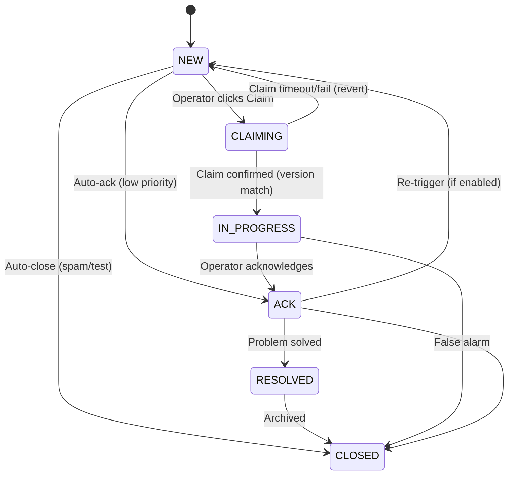

# 05_ALARM_LIFECYCLE.md

## Cel
Ten dokument opisuje cykl życia alarmu, logikę grupowania (bundling) oraz stany, przez które przechodzi incydent.

---

## 1. Definicje

### Raw Event (Zdarzenie Surowe)
Pojedynczy sygnał techniczny odebrany przez system.
- Źródła: Plik STAM, API Satel, SMS (modem).
- Przykłady: "Włamanie strefa 1", "Słaba bateria", "Temperatura wysoka".

### Bundle Alarm (Alarm Zgrupowany / Incydent)
Jednostka operacyjna, którą widzi i obsługuje człowiek. Powstaje z agregacji Raw Events.

---

## 2. Diagram Stanów (Alarm Bundle)



### Opis stanów (KANONICZNE — jedyna wersja):
- **NEW:** Alarm utworzony, nieobsłużony. Wymaga uwagi. Migający na czerwono.
- **CLAIMING:** Stan przejściowy (max 5s). Operator kliknął "Obsługuj", backend weryfikuje `version` i ustawia `assigned_user_id`. Jeśli `version` nie zgadza się (inny operator był szybszy) → revert do NEW. Frontend wyświetla spinner "Przypisywanie...".

> [!NOTE]
> **CLAIMING Reaper Job:** Backend API uruchamia periodyczny task (co 15s) revertujący alarmy zablokowane w stanie CLAIMING >10s:
> ```sql
> UPDATE bundle_alarms 
> SET status = 'NEW', assigned_user_id = NULL, version = version + 1
> WHERE status = 'CLAIMING' AND updated_at < NOW() - INTERVAL '10 seconds';
> ```
> Obie instancje Backend wykonują reaper — bezpieczne dzięki OCC (`version` bump). Każdy revert logowany w `AUDIT_LOG` jako `CLAIMING_TIMEOUT_REVERT`. Metryka Prometheus: `claiming_timeout_reverts_total`.
- **IN_PROGRESS:** Claim potwierdzony. Inni widzą, kto się tym zajmuje.
- **ACK (Acknowledged):** Alarm potwierdzony (np. "Wiem o tym, czekam na serwis"). Nie wyje, ale wisi na liście.
- **RESOLVED:** Problem rozwiązany, oczekuje na zamknięcie / archiwizację.
- **CLOSED:** Zakończony. Trafia do historii.

### Alarmy temperaturowe — specjalna reguła:
- Alarmy z czujników temp. (Efento/Bluelog) mają flagę `requires_note = true`.
- Nie można zamknąć (CLOSED) bez wpisania notatki wyjaśniającej przyczynę / podjęte działania.
- Dotyczy zarówno pojedynczych eventów jak i całego Bundle.

### Tabela przejść (wyczerpująca — każde inne przejście = 409 ALARM_INVALID_STATE):

| Z | Do | Trigger | Warunek |
|---|---|---|---|
| `NEW` | `CLAIMING` | `POST /alarms/{id}/claim` | `version` match |
| `CLAIMING` | `IN_PROGRESS` | Backend potwierdza claim (ta sama transakcja) | `assigned_user_id` ustawiony |
| `CLAIMING` | `NEW` | Timeout 5s lub błąd | Revert `assigned_user_id = NULL` |
| `NEW` | `ACK` | Auto-ack (niskopriorytetowy) | `priority = INFO` |
| `NEW` | `CLOSED` | Auto-close (spam/test) | Obiekt w trybie TEST |
| `IN_PROGRESS` | `ACK` | `POST /alarms/{id}/ack` | `version` match, notatka wymagana |
| `IN_PROGRESS` | `CLOSED` | `POST /alarms/{id}/close` | `version` match, fałszywy alarm |
| `ACK` | `RESOLVED` | `POST /alarms/{id}/resolve` | `version` match |
| `ACK` | `CLOSED` | `POST /alarms/{id}/close` | `version` match |
| `ACK` | `NEW` | Re-trigger (nowy event do bundle) | `BUNDLE_RETRIGGER_ENABLED = true` |
| `RESOLVED` | `CLOSED` | `POST /alarms/{id}/close` | `version` match, notatka jeśli `requires_note` |

> **Optimistic Locking:** Każda zmiana statusu wymaga podania aktualnej wartości `version` z frontendu. Backend wykonuje `UPDATE ... WHERE id = :id AND version = :version AND status = :expected_status`. Jeśli 0 wierszy zmodyfikowanych → `409 ALARM_STALE_VERSION` (ktoś inny zmodyfikował alarm w międzyczasie).

---

## 3. Logika Bundlingu (Grupowania)

Aby uniknąć "burzy alarmów" (alarm flood), system grupuje zdarzenia.

### Zasada grupowania:
1. Przychodzi **Event A** (Obiekt X, Typ: Włamanie).
2. Sprawdzamy, czy istnieje otwarty **Bundle** dla Obiektu X o podobnym priorytecie.
3. **JEŚLI TAK:**
   - Dodaj Event A do istniejącego Bundle.
   - Podbij licznik (`count++`).
   - Zaktualizuj `last_seen`.
   - Jeśli status był ACK, może (konfigurowalne) wrócić do NEW (re-trigger).
4. **JEŚLI NIE:**
   - Utwórz nowy Bundle.
   - Status = NEW.
   - `first_seen` = teraz.

### Okno czasowe:

> [!IMPORTANT]
> **Per-Object Override:** Wartości okna bundlingu i auto-close mogą być nadpisane per obiekt w tabeli `OBJECT_ALARM_CONFIG` (pola `bundle_window_minutes`, `auto_close_timeout_hours`). Jeśli konfiguracja per obiekt istnieje, ma pierwszeństwo nad wartościami globalnymi poniżej. Szczegóły: **04_DATA_MODEL_ERD.md** (encja `OBJECT_ALARM_CONFIG`).

> [!CAUTION]
> **Alarmy CRITICAL nigdy nie są automatycznie zamykane.** Wymagają pełnej ścieżki operatora: `ACK → RESOLVED → CLOSED`. Auto-close dla CRITICAL = ukrycie nieobsłużonego zagrożenia.

- **CRITICAL:** Auto-close **WYŁĄCZONY**. Parametr: `BUNDLE_AUTO_CLOSE_CRITICAL = false`.
- **WARNING:** Auto-close po **8 godzinach** spokoju (brak nowych eventów). Parametr: `BUNDLE_AUTO_CLOSE_HOURS_WARNING = 8`.
- **INFO:** Auto-close po **4 godzinach** spokoju. Parametr: `BUNDLE_AUTO_CLOSE_HOURS_INFO = 4`.
- W MVP zamykanie CRITICAL jest wyłącznie ręczne.
- **Stale Alarm Report:** Codzienny cron job (`stale_alarm_report`) generuje raport Bundle CRITICAL otwartych >24h. Raport wysyłany do użytkowników z rolą MASTER. Szczegóły: **03_FUNCTIONAL_MODULES.md**.

### Klucz grupowania:
- Bundle grupuje po: `(object_id, priority)`.
- CRITICAL i WARNING to **osobne Bundle** (nigdy nie łączone).
- Alarmy TEMP (SMS) tworzą **osobne Bundle** od alarmów SATEL (nawet dla tego samego obiektu).
- Alarmy UNAUTHORIZED_ACCESS tworzą **osobne Bundle** (priorytet WARNING lub CRITICAL wg konfiguracji obiektu).

### Re-trigger:
- Domyślnie **wyłączony** w MVP.
- Jeśli włączony: event do Bundle w statusie ACK zmienia status z powrotem na NEW.
- Konfigurowalny parametr: `BUNDLE_RETRIGGER_ENABLED` (default: false).

### Algorytm deduplikacji:
- Klucz deduplikacji (`dedup_key`) generowany per źródło:
  - SATEL: `{panel_id}:{event_code}:{zone_id}:{timestamp zaokrąglony do minuty}`
  - SMS_EFENTO: `SMS_EFENTO:{sensor_name}:{event_type}:{timestamp zaokrąglony do minuty}`
  - SMS_BLUELOG: `SMS_BLUELOG:{device_id}:{event_type}:{timestamp zaokrąglony do minuty}`

> [!IMPORTANT]
> **Pole `event_type` w kluczu SMS** zapobiega fałszywej deduplikacji: jeśli w tej samej minucie nadejdzie SMS "Alarm" i SMS "Powrót do normy" z tego samego czujnika, oba zostaną przetworzone (różne `event_type` = różne `dedup_key`).

- Granularność: 1 minuta (ten sam event w tej samej minucie = duplikat).
- Pełna specyfikacja: **13_EVENT_SCHEMAS.md, sekcja 6**.

---

## 4. Priorytety

| Priorytet | Kolor | Przykłady | Zachowanie |
|---|---|---|---|
| **CRITICAL** | Czerwony | Włamanie, Sabotaż, Panika | Wymaga natychmiastowej reakcji, dźwięk ciągły. |
| **WARNING** | Pomarańczowy | Awar. zasilania, Temp. wysoka | Wymaga reakcji, dźwięk pojedynczy. |
| **INFO** | Niebieski/Szary | Załączenie, Wyłączenie, Test | Logowane, nie budzi operatora (chyba że reguła mówi inaczej). |

---

## 5. Eskalacje (v1.0)
- Jeśli alarm statusu NEW wisi > 5 min → Powiadomienie do Mastera.
- Jeśli alarm statusu NEW wisi > 15 min → SMS do kierownika.
- **Jeśli alarm o priorytecie CRITICAL pozostaje w statusie NEW przez 60 minut** → system automatycznie wysyła SMS do użytkownika z rolą MASTER.
  - Parametr konfiguracyjny: `ESCALATION_CRITICAL_HOURS = 1` (domyślnie).
  - SMS wysyłany przez SMS Agent (modem GSM) — jeśli dostępny, lub przez fallback API.
  - Zdarzenie eskalacji jest logowane w `AUDIT_LOG` z akcją `ESCALATION_SMS`.
  - Treść SMS: `"[STAM] CRITICAL ALARM nieobsłużony >1h: {object_name} - {alarm_description}. Bundle ID: {bundle_id}"`

---

## 6. Zdarzenia Specjalne

### 6.1 Nieautoryzowany Dostęp (UNAUTHORIZED_ACCESS)

Centrala SATEL generuje zdarzenia związane z próbami nieautoryzowanego dostępu:

**Typy zdarzeń:**
- 3 błędne hasła na manipulatorze / czytniku.
- Nieautoryzowana próba dostępu (użycie nieznanego kodu).

**Obsługa w systemie:**
1. Satel Worker odbiera zdarzenie poprzez protokół ETHM-1 (kody zdarzeń: patrz **14_SATEL_COMMANDS.md, sekcja 4** i **06_INTEGRATIONS.md, sekcja 1.4**).
2. Zdarzenie klasyfikowane jako typ `UNAUTHORIZED_ACCESS`.
3. System tworzy Bundle Alarm o priorytecie:
   - `WARNING` (domyślnie) lub
   - `CRITICAL` (w zależności od konfiguracji obiektu — np. obiekty wysokiego ryzyka).
4. Bundle Alarm wymaga obowiązkowej notatki przy zamknięciu (`requires_note = true`), ponieważ może wskazywać na próbę włamania.
5. Zdarzenie logowane w `AUDIT_LOG`.

**Dedup key:** `{panel_id}:UNAUTHORIZED_ACCESS:{timestamp_minute}`

---

## 7. Tryby Specjalne

### 7.1 Tryb Testowy (Test Mode)
- Włączany per Obiekt.
- Eventy są zapisywane, ale nie generują głośnych Bundle (lub mają flagę TEST).
- Nie wysyłają powiadomień zewnętrznych.

### 7.2 Tryb Serwisowy (Service Mode)

> [!IMPORTANT]
> **Tryb Serwisowy jest podzielony między 2 fazy:**
> - **Faza 1 (config):** Kolumny `service_mode_*` w OBJECTS, endpointy aktywacji/dezaktywacji, UI w szczegółach obiektu.
> - **Faza 2 (efekt alarmowy):** Logika tłumienia w pipeline, wizualne odróżnienie na dashboardzie, brak dźwięku.

#### Faza 1 — Konfiguracja
- Włączany per Obiekt przez `POST /api/objects/{id}/service-mode`.
- Kolumny w OBJECTS: `service_mode_active`, `service_mode_until`, `service_mode_reason`, `service_mode_activated_by`.
- Auto-dezaktywacja: jeśli `service_mode_until` != null i czas minął, backend cron dezaktywuje tryb.
- Widoczne w UI: 🔧 ikona obok nazwy obiektu.
- Wpis w `AUDIT_LOG` przy aktywacji i dezaktywacji.

#### Faza 2 — Efekt Alarmowy
- Eventy są zapisywane normalnie w `EVENTS`.
- Bundle tworzony, ale z modyfikacjami:
  - Priorytet obniżony o 1 poziom (CRITICAL → WARNING, WARNING → INFO).
  - **Brak dźwięku** na UI Flutter (alarmy z obiektów w trybie serwisowym nie triggują notyfikacji dźwiękowej).
  - **Wizualne odróżnienie:** Szary styl + ikona 🔧 na dashboardzie operàtora.
- **Push notifications (FCM):** NIE wysłane dla alarmów z obiektów w trybie serwisowym.
- Eskalacje (sekcja 5) działają normalnie — tryb serwisowy NIE blokuje eskalacji.


---
---


# 14_SATEL_COMMANDS

## Cel
Referencyjna tabela komend protokołu ETHM-1 używanych przez Satel Worker. Dokument oparty o oficjalną specyfikację "Protokół integracji ETHM-1".

> **Uwaga:** Poniższe kody komend odpowiadają oficjalnemu protokołowi. Szczegóły bitowe (format ramki, CRC) opisano w sekcji 4.

---

## 1. Komendy MVP (must-have do pierwszego połączenia)

### 1.1 Komendy odczytu stanu (polling)

| Cmd | Hex | Nazwa | Opis | Częstotliwość |
|---|---|---|---|---|
| New Data | 0x7F | Sprawdź zmiany | Zwraca flagę, czy coś się zmieniło od ostatniego zapytania. Podstawowa komenda heartbeat/polling. | Co 1s |
| Zones Violation | 0x00 | Stan wejść (naruszenie) | Bitfields — które wejścia są naruszone | Co 2s lub po "New Data" |
| Zones Tamper | 0x01 | Stan wejść (sabotaż) | Bitfields — które wejścia mają sabotaż | Co 5s |
| Zones Alarm | 0x02 | Stan wejść (alarm) | Bitfields — które wejścia są w alarmie | Co 2s |
| Zones Tamper Alarm | 0x03 | Alarm sabotażu wejść | Bitfields | Co 5s |
| Partitions State (byte 1) | 0x09 | Stan stref | Armed / Disarmed / Alarm / Entry delay / Exit delay | Co 2s |
| Partitions Alarm | 0x13 | Alarmy stref | Które strefy są w alarmie | Co 2s |
| Outputs State | 0x17 | Stan wyjść | ON / OFF per wyjście | Co 5s |
| Troubles Part 1-5 | 0x1C-0x20 | Awarie systemowe | AC loss, Battery, Tamper obudowy, etc. | Co 10s |

### 1.2 Inicjalizacja połączenia

Sekwencja startowa po nawiązaniu połączenia TCP:

1. **Connect** do ETHM-1 na port 10004 (TCP)
2. **Handshake/Auth** — jeśli moduł wymaga kodu integracji, wysłać komendę autoryzacji
3. **Full State Dump** — odpytać kolejno:
   - 0x00 (Zones Violation)
   - 0x01 (Zones Tamper)
   - 0x02 (Zones Alarm)
   - 0x09 (Partitions State)
   - 0x17 (Outputs State)
   - 0x1C-0x20 (Troubles)
4. **Zapisać w Redis** — pełny stan centrali
5. **Przejść w tryb polling** — 0x7F co 1s, szczegółowe komendy wg potrzeb

---

## 2. Komendy sterujące (v2.0)

| Cmd | Hex | Nazwa | Opis | Parametry |
|---|---|---|---|---|
| Arm Mode 0 | 0x80 | Uzbrojenie pełne | Full arm wybranych stref | user_code + partition_mask |
| Arm Mode 1 | 0x81 | Uzbrojenie nocne | Stay arm | user_code + partition_mask |
| Arm Mode 2 | 0x82 | Uzbrojenie bez wewnętrznych | Away arm (bez czujek wewnętrznych) | user_code + partition_mask |
| Disarm | 0x84 | Rozbrojenie | Disarm wybranych stref | user_code + partition_mask |
| Output On | 0x88 | Włącz wyjście | Załącz wyjście (np. bramę) | output_mask |
| Output Off | 0x89 | Wyłącz wyjście | Wyłącz wyjście | output_mask |
| Clear Alarm | 0x85 | Kasowanie alarmu | Reset alarmu w centrali | user_code + partition_mask |

---

## 3. Format Ramki

### Request (Worker → ETHM-1)

```
┌────────┬────────┬───────────┬──────────────┬──────────┬────────┐
│ 0xFE   │ 0xFE   │ CMD (1B)  │ DATA (0-nB)  │ CRC (2B) │ 0xFE   │
│ start  │ start  │           │              │ CRC-16   │ 0x0D   │
└────────┴────────┴───────────┴──────────────┴──────────┴────────┘
```

### Response (ETHM-1 → Worker)

```
┌────────┬────────┬───────────┬──────────────┬──────────┬────────┐
│ 0xFE   │ 0xFE   │ CMD (1B)  │ DATA (0-nB)  │ CRC (2B) │ 0xFE   │
│ start  │ start  │ echo/resp │              │ CRC-16   │ 0x0D   │
└────────┴────────┴───────────┴──────────────┴──────────┴────────┘
```

### Obliczanie CRC-16
- Algorytm: CRC-CCITT (zgodnie z dokumentacją Satel)
- Polynomial: 0x1021
- Init: 0x147A (specyficzne dla Satel)
- Obliczane z: CMD + DATA

### Bajt-stuffing
- Jeśli w danych występuje bajt 0xFE, musi być zdublowany (0xFE 0xFE) aby nie został zinterpretowany jako marker startu/stopu
- Worker musi dekodować stuffing przy odbieraniu i kodować przy wysyłaniu

---

## 4. Mapowanie Event Codes → Typy Alarmów

| Event Code (hex) | Typ w systemie | Priorytet | Opis |
|---|---|---|---|
| Zone violation (0x00 bit=1) | `ALARM` | CRITICAL | Naruszenie wejścia — włamanie |
| Zone tamper (0x01 bit=1) | `TAMPER` | CRITICAL | Sabotaż czujki |
| Zone alarm (0x02 bit=1) | `ALARM` | CRITICAL | Alarm aktywny na wejściu |
| Partition armed (0x09) | `ARM` | INFO | Strefa uzbrojona |
| Partition disarmed (0x09) | `DISARM` | INFO | Strefa rozbrojona |
| Partition alarm (0x13 bit=1) | `ALARM` | CRITICAL | Alarm na strefie |
| AC loss (0x1C bit) | `TROUBLE` | WARNING | Brak zasilania 230V |
| Battery low (0x1C bit) | `TROUBLE` | WARNING | Słaby akumulator |
| Comm trouble (0x1D bit) | `TROUBLE` | WARNING | Awaria komunikacji |
| 3 wrong passwords (keypad event) | `UNAUTHORIZED_ACCESS` | WARNING/CRITICAL | 3 bledne hasla na manipulatorze/czytniku |
| Unknown access code (keypad event) | `UNAUTHORIZED_ACCESS` | WARNING/CRITICAL | Proba uzycia niezarejestrowanego kodu |

---

## 5. Keep-Alive i Reconnect

### Heartbeat
- Worker wysyła 0x7F (New Data) co **1 sekundę**
- Jeśli brak odpowiedzi w ciągu **3 sekund** → uznaj połączenie za zerwane

### Reconnect Logic (Exponential Backoff)

| Próba | Delay | Akcja |
|---|---|---|
| 1 | 1s | Reconnect |
| 2 | 2s | Reconnect |
| 3 | 4s | Reconnect + alert WARNING |
| 4 | 8s | Reconnect |
| 5 | 16s | Reconnect + alert CRITICAL |
| 6+ | 30s | Reconnect (cap at 30s) |
| Po 5 min | — | Alert: "Panel {id} — brak komunikacji > 5 min" |

### Po reconnect
1. Full State Dump (sekcja 1.2)
2. Porównanie nowego stanu z ostatnim znanym (Redis)
3. Wygenerowanie delta events (co się zmieniło w trakcie downtime)
4. Publikacja delta events do RabbitMQ

---

## 6. Ograniczenia ETHM-1

| Ograniczenie | Wartość | Implikacja |
|---|---|---|
| Max połączeń TCP | **1** | Worker = exclusive, żadne inne narzędzie nie może się łączyć w tym samym czasie |
| Max stref | 32 (INTEGRA 128) | Bitfield: 4 bajty per komenda stref |
| Max wejść | 128 (INTEGRA 128) | Bitfield: 16 bajtów per komenda wejść |
| Max wyjść | 128 | Bitfield: 16 bajtów |
| Timeout odpowiedzi | ~2s | Jeśli brak odpowiedzi > 2s → retry raz, potem reconnect |

---

## 7. Fuzz Testing — ETHM-1 Parser (SAT-05)

> **Cel:** Upewnić się, że parser ramek binarnych nie crashuje, nie wchodzi w nieskończoną pętlę i nie leakuje pamięci przy złośliwych/uszkodzonych danych.

### 7.1 Zakres testów

| Scenariusz | Opis | Oczekiwany wynik |
|---|---|---|
| **Ramka bez terminatora** | 0xFE 0xFE + dane, brak kompletnej ramki | Timeout → reconnect, brak crash |
| **CRC nieprawidłowy** | Poprawna ramka z błędnym CRC-16 | Odrzucenie ramki, log WARNING, retry |
| **Ramka zerowa** | 100 bajtów 0x00 | Odrzucenie, nie wchodzi w parser |
| **Ramka gigantyczna** | 64KB danych po 0xFE 0xFE | Buffer limit reached → drop, log ERROR |
| **Ramka z ujemnymi wartościami** | Bitfield ze wszystkimi bitami = 1 | Parser traktuje jako "wszystkie strefy w alarmie" (poprawnie) |
| **Losowe bajty** | Randomowe 1-1000 bajtów | Brak crash, brak memory leak |
| **Replay attack** | Powtórzenie tej samej ramki 1000x w 1 sekundzie | Deduplikacja, brak flood do RabbitMQ |
| **Partial frame + disconnect** | Pół ramki → TCP disconnect | Cleanup buffera, reconnect |

### 7.2 Narzędzia

- **Python:** `hypothesis` library (property-based testing) z custom strategy dla ramek SATEL.
- **CI/CD:** Fuzz testy uruchamiane w pipeline z symulatororem ETHM-1 (tryb `FLAKY` + `TIMEOUT`).
- **Czas:** Min. 10 min fuzz per build (configurable).

### 7.3 Implementacja

```python
from hypothesis import given, strategies as st

# Generuj losowe "ramki" ETHM-1
satel_frame = st.binary(min_size=0, max_size=65535)

@given(raw_data=satel_frame)
def test_parser_never_crashes(raw_data: bytes):
    """Parser MUSI zwrócić ParsedFrame lub ParsingError — nigdy wyjątek."""
    result = parse_ethm1_frame(raw_data)
    assert isinstance(result, (ParsedFrame, ParsingError))
```

---

## 8. Connection Release API (Endpoint DLOAD)

> Pełna specyfikacja endpointu: `06_INTEGRATIONS.md`, sekcja 1.7.

Satel Worker respektuje sygnał `connection_release` dla danego panelu. Komendy sterowania wysłane w trakcie release zwracają `409 PANEL_RELEASED`:

```json
{
  "error": {
    "code": "PANEL_RELEASED",
    "message": "Panel PAT001 jest tymczasowo rozłączony (DLOAD session). Reconnect za 25 min.",
    "details": { "reconnect_at": "2026-02-16T15:00:00Z" }
  }
}
```
